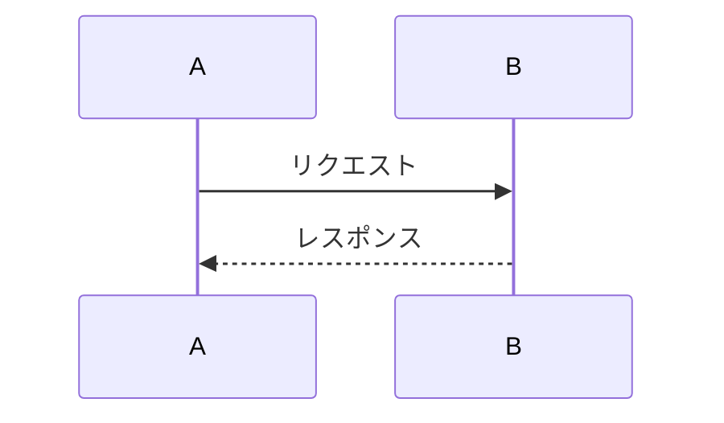

# Report Template

Pandoc + XeLaTeX を用いた日本語レポート・論文テンプレートです。
Markdown で執筆し、PDF を生成します。

## 機能

- 表紙・目次の自動生成
- 図・表・数式の自動番号付けと相互参照 (pandoc-crossref)
- 参考文献の自動管理 (BibTeX + CSL)
- Mermaid 図の描画
- ファイルインポート (`@import`)
- 複数画像の並列配置
- 改ページ制御

## 必要な環境

| ツール | 用途 | 必須 |
|--------|------|------|
| [Pandoc](https://pandoc.org/) | Markdown → PDF 変換 | Yes |
| XeLaTeX (TeX Live / TinyTeX) | PDF 生成エンジン | Yes |
| [pandoc-crossref](https://github.com/lierdakil/pandoc-crossref) | 図表・数式の相互参照 | Yes |
| 日本語フォント (Harano Aji Mincho) | 日本語表示 | Yes |
| [mermaid-cli](https://github.com/mermaid-js/mermaid-cli) | Mermaid 図の描画 | No |

詳細なセットアップ手順は [MANUAL_SETUP.md](MANUAL_SETUP.md) を参照してください。

## 使い方

### 1. Markdown ファイルを編集

`sample_paper.md` をベースに、YAML フロントマターのメタデータを書き換えます。

```yaml
---
document_year: "令和xx年度"
document_type: "卒業論文"
title: "論文タイトル"
student_id: "学籍番号"
author: "氏名"
affiliation: "所属"
supervisor: "指導教員"
date: "yyyy年mm月dd日"
---
```

### 2. PDF をビルド

```powershell
.\build.ps1 -InputFile sample_paper.md
```

VSCode の場合は `Ctrl+Shift+B` でビルドタスクを実行できます。

## ファイル構成

```
.
├── sample_paper.md          # サンプル原稿 (テンプレート)
├── sample_paper.pdf         # 生成される PDF
├── build.ps1                # ビルドスクリプト
├── references.bib           # 参考文献データベース
├── japanese-reference.csl   # 引用スタイル (日本語)
├── pandoc/
│   ├── header.tex           # LaTeX ヘッダー
│   ├── paper-filter.lua     # 表紙・レイアウト用フィルター
│   ├── mermaid.lua          # Mermaid 図変換フィルター
│   ├── cite-superscript.lua # 引用上付き文字フィルター
│   ├── defaults.yaml        # Pandoc デフォルト設定
│   └── preview-style.css    # プレビュー用スタイル
├── mermaid/                 # Mermaid 図のキャッシュ
├── MANUAL_SETUP.md          # 環境セットアップガイド
└── image*.jpg               # サンプル画像
```

## 記法リファレンス

### 画像

```md
{#fig:label}
```

参照: `[@fig:label]`

### 複数画像

```md
::: {.figures cols=2}
{#fig:img1 width=40%}
{#fig:img2 width=40%}
:::
```

### 表

```md
| 列1 | 列2 |
|:----|:----|
| A   | B   |

: キャプション {#tbl:label}
```

参照: `[@tbl:label]`

### 数式

```md
$$
\int_0^1 f(x) dx
$${#eq:label}
```

参照: `[@eq:label]`

### 参考文献

`references.bib` に文献を追加し、本文中で `[@key]` で引用します。

```md
～である[@article_key]．

::: {#refs}
:::
```

### Mermaid 図

````md

````

### 改ページ

```md
:::page-break
:::
```

### ファイルインポート

```md
@import "./sample.py"
```
