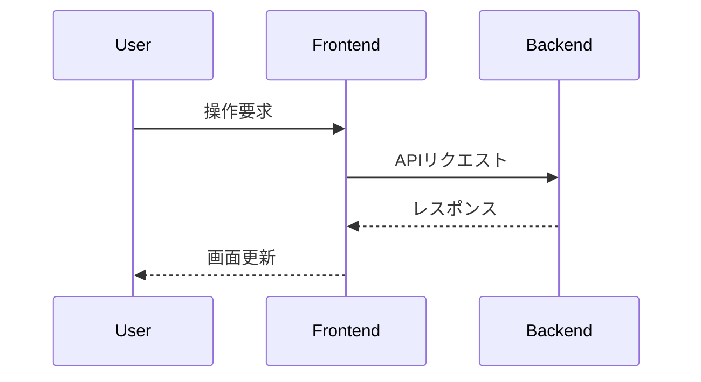

:::cover
:::

\tableofcontents
\newpage

# システム構成

本テンプレートは **Pandoc** を中核に，複数のフィルターとツールを組み合わせて Markdown から学術論文PDF を生成するシステムである．

## 処理パイプライン

ビルド時，以下の順序でフィルターが実行される（`build.ps1` で定義）．

| 順序 | フィルター              | 種類          | 役割                                      |
| :--: | :---------------------- | :------------ | :---------------------------------------- |
|  1   | `mermaid.lua`           | Lua フィルター | Mermaid記法をPNG画像に変換                |
|  2   | `paper-filter.lua`      | Lua フィルター | 表紙・改ページ・横並び画像・表キャプション・ファイルインポートなどの独自記法を処理 |
|  3   | `pandoc-crossref`       | 外部フィルター | 図・表・数式・節の相互参照と自動番号付け  |
|  4   | `citeproc`              | Pandoc 内蔵   | 参考文献の処理（BibTeX + CSL）            |
|  5   | `cite-superscript.lua`  | Lua フィルター | 引用番号 `[1]` を上付き文字に変換         |

最終的に **XeLaTeX** でPDFが生成される．

## ファイル構成

```
report_template/
├── build.ps1                 # ビルドスクリプト（PowerShell）
├── sample_paper.md           # テンプレート文書
├── references.bib            # 参考文献データベース（BibTeX）
├── japanese-reference.csl    # 引用スタイル定義（CSL）
├── pandoc/
│   ├── defaults.yaml         # Pandoc デフォルト設定
│   ├── header.tex            # LaTeX プリアンブル（環境定義・フォント設定）
│   ├── paper-filter.lua      # 独自記法フィルター（メイン）
│   ├── mermaid.lua           # Mermaid 図変換フィルター
│   ├── cite-superscript.lua  # 引用上付き変換フィルター
│   └── preview-style.css     # プレビュー用スタイル
├── mermaid/                  # Mermaid 画像キャッシュ（自動生成）
└── .vscode/
    ├── settings.json         # エディタ設定
    └── tasks.json            # ビルドタスク定義
```

## ビルド方法

PowerShellで以下を実行する．

```powershell
.\build.ps1 -InputFile sample_paper.md
```

VSCode では `Ctrl+Shift+B` でビルドタスクを実行できる．

:::page-break
:::

# 文書メタデータ（YAML Frontmatter）

ファイル先頭に YAML 形式でメタデータを記述する．表紙の生成やpandoc-crossrefの日本語設定に使用される．

```yaml
---
document_year: "令和xx年度"       # 年度（表紙に表示）
document_type: "卒業論文"         # 文書タイプ（表紙に表示）
title: "論文タイトル"             # タイトル（表紙に表示）
student_id: "S123456"             # 学籍番号（表紙に表示）
author: "著者名"                  # 著者名（表紙に表示）
affiliation: "所属学科"           # 所属（表紙に表示）
supervisor: "指導教員名"          # 指導教員（表紙に表示）
date: "yyyy年mm月dd日"            # 日付（表紙に表示）
lang: ja                          # 言語
mainfont: "Harano Aji Mincho"     # 本文フォント
linestretch: 1.25                 # 行間
parskip: 0.5em                    # 段落間スペース
figPrefix: "図"                   # 図参照の接頭辞
tblPrefix: "表"                   # 表参照の接頭辞
eqnPrefix: "式"                   # 数式参照の接頭辞
---
```

:::page-break
:::

# 独自拡張記法

`paper-filter.lua` によって処理される独自の記法を解説する．

## 表紙

YAMLメタデータの内容を用いて論文の表紙を生成する．
LaTeX出力時は中央揃えの表紙ページが生成され，ページ番号が1にリセットされる．

```markdown
:::cover
:::
```

表紙には以下の情報が表示される：年度・文書タイプ，タイトル，学籍番号，氏名，所属学科，指導教員，日付．

## 改ページ

強制的に改ページを行う．LaTeX出力時は `\newpage`，HTML出力時は `page-break-after: always` に変換される．

**記法1（Fenced Div）:**
```markdown
:::page-break
:::
```

**記法2（HTMLタグ）:**
```html
<div class="page-break"></div>
```

## 複数画像の横並びレイアウト

`:::figures` （または `::: {.figures}`）で囲んだ画像を横並びに配置できる．
LaTeX出力時は `minipage` 環境，HTML出力時は flexbox レイアウトで描画される．

### 基本（幅指定あり）

```markdown
::: {.figures}
{#fig:a width=40%}
{#fig:b width=40%}
:::
```

### 列数指定（cols）

`cols` 属性で1行あたりの画像数を指定する．画像数が `cols` を超えると自動的に次の行に折り返す．

```markdown
::: {.figures cols=2}
{#fig:c}
{#fig:d}
{#fig:e}
{#fig:f}
:::
```

### 高さ指定（height）

ブロック全体のデフォルト高さを指定できる．各画像に個別の `height` を指定した場合はそちらが優先される．

```markdown
::: {.figures height=5cm}
{#fig:g}
{#fig:h}
:::
```

### 属性一覧

| 属性     | 対象           | 説明                               | 例               |
| :------- | :------------- | :--------------------------------- | :--------------- |
| `cols`   | ブロック全体   | 1行あたりの列数（デフォルト:画像数） | `cols=2`         |
| `height` | ブロック全体   | デフォルトの画像高さ               | `height=5cm`     |
| `width`  | 個別の画像     | 画像の幅（%指定）                  | `width=40%`      |
| `height` | 個別の画像     | 画像の高さ（ブロック設定より優先） | `height=3cm`     |

## 表キャプション記法

`[Table: キャプション]{#tbl:ラベル}` の形式で表のキャプションを記述できる．`paper-filter.lua` が表番号を自動付与し，`[@tbl:ラベル]` で参照できる．

```markdown
[Table: 実験結果の比較]{#tbl:results}

| 手法     | 精度 |
| :------- | :--- |
| 提案手法 | 95%  |
| 従来手法 | 80%  |

[@tbl:results]に結果を示す．
```

pandoc-crossref の標準記法（表の下にキャプションを書く形式）も使用できる．

```markdown
| 手法     | 精度 |
| :------- | :--- |
| 提案手法 | 95%  |
| 従来手法 | 80%  |

: 実験結果の比較 {#tbl:results}
```

## ファイルインポート

`@import "ファイルパス"` でソースコードなどの外部ファイルを読み込み，コードブロックとして挿入する．ファイル拡張子から言語を自動判定し，シンタックスハイライトが適用される．

```markdown
@import "./sample.py"
```

対応する拡張子と言語の対応：

| 拡張子                              | 言語          |
| :---------------------------------- | :------------ |
| `.py`                               | Python        |
| `.js`                               | JavaScript    |
| `.ts`                               | TypeScript    |
| `.c`, `.h`                          | C             |
| `.cpp`, `.hpp`, `.ino`              | C++           |
| `.java`                             | Java          |
| `.go`                               | Go            |
| `.rs`                               | Rust          |
| `.rb`                               | Ruby          |
| `.lua`                              | Lua           |
| `.sh`, `.bash`                      | Bash          |
| `.ps1`                              | PowerShell    |
| `.yaml`, `.yml`                     | YAML          |
| `.json`                             | JSON          |
| `.html`, `.css`, `.xml`             | HTML/CSS/XML  |
| `.sql`                              | SQL           |
| `.tex`                              | LaTeX         |
| `.md`                               | Markdown      |
| `.toml`                             | TOML          |

:::page-break
:::

# 標準 Pandoc / pandoc-crossref 記法

以下は Pandoc および pandoc-crossref の標準機能である．

## 図（Figures）

画像に `{#fig:ラベル}` を付けると，図番号が自動付与され `[@fig:ラベル]` で参照できる．

**定義:**
```markdown
{#fig:system}
```

**参照:**
```markdown
[@fig:system]にシステム構成を示す．
```

## 数式（Equations）

`$$` で囲んだ数式に `{#eq:ラベル}` を付けると，式番号が自動付与される．

**定義:**
```markdown
$$
E = mc^2
$${#eq:einstein}
```

**参照:**
```markdown
[@eq:einstein]より導かれる．
```

## 節の参照

セクション見出しに `{#sec:ラベル}` を付けると `[@sec:ラベル]` で参照できる．

```markdown
## 実験方法 {#sec:method}

詳細は[@sec:method]を参照．
```

## 見出しの表示形式

`header.tex` の設定により，レベル1見出しは「第n章」形式で表示される．

```markdown
# 見出し1        → 第1章 見出し1
## 見出し2       → 1.1 見出し2
### 見出し3      → 1.1.1 見出し3
```

レベル1見出しの前には自動で改ページが挿入される（`paper-filter.lua` の `Pandoc` 関数で処理）．

## 目次

LaTeX の `\tableofcontents` コマンドで目次を挿入する．通常は表紙の直後に配置する．

```markdown
:::cover
:::

\tableofcontents
\newpage
```

:::page-break
:::

# Mermaid ダイアグラム

`mermaid.lua` フィルターにより，Mermaid 記法のコードブロックが自動的に画像に変換される．

## 記法

````markdown

````

## 動作仕組み

1. コードブロックの内容からSHA1ハッシュを計算
2. `mermaid/` ディレクトリにキャッシュを確認（同じ内容なら再生成しない）
3. キャッシュがなければ `mmdc`（mermaid-cli）を実行してPNG画像を生成
4. コードブロックを生成された画像に置換

## 環境変数

| 変数名            | デフォルト値 | 説明                          |
| :---------------- | :----------- | :---------------------------- |
| `MERMAID_MMDC`    | `mmdc`       | mermaid-cli の実行ファイルパス |
| `MERMAID_FORMAT`  | `png`        | 出力形式（`png` / `svg`）     |
| `MERMAID_OUT_DIR` | `mermaid/`   | 画像キャッシュディレクトリ    |

`mmdc` が見つからない場合は警告が表示され，コードブロックがそのまま残る．

:::page-break
:::

# 参考文献・引用

## 参考文献データベース

`references.bib` に BibTeX 形式で文献を登録する．

```bibtex
@article{article_pattern_recognition,
  title={Pattern Recognition and Machine Learning},
  author={Christopher M. Bishop},
  year={2006},
  url={https://example.com/prml.pdf}
}
```

## 本文中の引用

```markdown
～がニューラルネットワークである[@article_pattern_recognition]．
```

`cite-superscript.lua` により，引用番号は上付き文字として表示される（例: `[1]` → 上付きの `[1]`）．

## 参考文献リストの挿入

文書末尾に以下を記述すると，そこに参考文献リストが生成される．

```markdown
::: {#refs}
:::
```

引用スタイルは `japanese-reference.csl` で定義されており，番号順の日本語学術形式で出力される．

:::page-break
:::

# LaTeX ヘッダー設定（header.tex）

`pandoc/header.tex` で以下の設定が行われている．

## フォント

| 用途       | フォント           |
| :--------- | :----------------- |
| 本文       | Harano Aji Mincho  |
| コードブロック | BIZ UDGothic       |

## ページレイアウト

| 項目       | 値      |
| :--------- | :------ |
| 上余白     | 30mm    |
| 下余白     | 30mm    |
| 左余白     | 20mm    |
| 右余白     | 20mm    |
| 行間       | 1.25    |
| 段落間     | 0.5em   |
| 字下げ     | 1em     |

## 主要な LaTeX パッケージ

| パッケージ    | 用途                             |
| :------------ | :------------------------------- |
| `graphicx`    | 画像の挿入                       |
| `caption`     | キャプション制御                 |
| `subcaption`  | サブキャプション（横並び画像用） |
| `indentfirst` | セクション直後の字下げ           |

表のキャプションは日本語論文の慣例に従い，表の上に配置される．

:::page-break
:::

# 必要な環境

## 必須ツール

| ツール           | 用途                         |
| :--------------- | :--------------------------- |
| Pandoc           | 文書変換エンジン             |
| XeLaTeX          | PDF生成（TeX Live / TinyTeX）|
| pandoc-crossref  | 相互参照処理                 |
| Harano Aji フォント | 日本語表示                   |

## オプション

| ツール                         | 用途                   |
| :----------------------------- | :--------------------- |
| Node.js + \@mermaid-js/mermaid-cli | Mermaid ダイアグラム描画 |
| VSCode + Markdown Preview Enhanced | プレビュー環境         |
