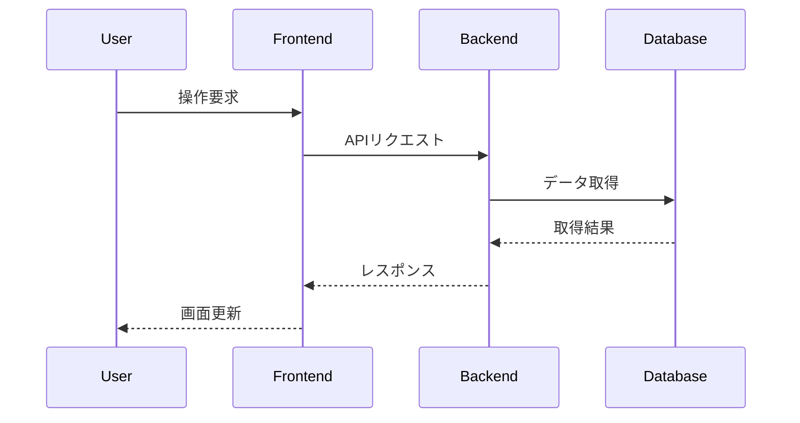

<style>
p {
  padding-left: 1em;
  text-indent: -1em;
}
li > p {
  padding-left: 0;
  text-indent: 0;
}
</style>

:::cover
:::

\tableofcontents
\newpage

# 見出し1(第n章で表示される)
## 見出し2 (1.1 のように表示される)
### 見出し3 (1.1.1 のように表示される)

# 各種記法

## 画像

### 記法(基本)
画像に関して[@fig:image1]で自動で番号付けされて参照可能．

```md
{#fig:image1}
```
### 見え方(基本)
{#fig:image1}

### 記法(複数画像1)

複数の画像を並べることもできる．
このとき，画像の横幅を決めることができる

```md
::: {.figures}
{#fig:image1_1 width=40%}
{#fig:image1_2 width=40%}
:::
```

### 見え方(複数画像1)
::: {.figures}
{#fig:image1_1 width=40%}
{#fig:image1_2 width=40%}
:::

### 記法(複数画像2)
複数の画像を並べるときの，横の数を決めることもできる．

```md
::: {.figures cols=2}
{#fig:image1_1}
{#fig:image1_2}
{#fig:image1_2}
{#fig:image1_2}
:::
```

### 記法(複数画像2)
::: {.figures cols=2}
{#fig:image1_1}
{#fig:image1_2}
{#fig:image1_2}
{#fig:image1_2}
:::

### 記法(複数画像3)
高さを決めることもできる

```md
::: {.figures height=5cm}
{#fig:image1_1}
{#fig:image1_2}
{#fig:image1_2}
{#fig:image1_2}
:::
```

### 記法(複数画像4)
::: {.figures height=5cm}
{#fig:image1_1}
{#fig:image1_2}
{#fig:image1_2}
{#fig:image1_2}
:::

## 改ページ
### 記法
(次のページに行きます)
```md
:::page-break
:::
```

:::page-break
:::

## ファイルインポート
### 記法
```
@import "./sample.py"
```

### 見え方
@import "./sample.py"


## 表
### 記法
```
| 手法     | 精度 |
| :------- | :--- |
| 提案手法 | 95%  |
| 従来手法 | 80%  |

: 実験結果の比較 {#tbl:results}

[@tbl:results]に記す．
```

### 見え方
| 手法     | 精度 |
| :------- | :--- |
| 提案手法 | 95%  |
| 従来手法 | 80%  |

: 実験結果の比較 {#tbl:results}

[@tbl:results]に記す．

## 数式
### 記法
```
$$
\int_0^1 f(x) dx.
$${#eq:formula}

式は[@eq:formula]のとおりである．
```

### 見え方

$$
\int_0^1 f(x) dx.
$${#eq:formula}

式は[@eq:formula]のとおりである．

## 参考文献/参照
### 記法
references.bibにて
```references.bib
@article{article_pattern_recognition,
  title={Pattern Recognition and Machine Learning},
  author={Christopher M. Bishop},
  year={2006},
  url={https://www.microsoft.com/en-us/research/wp-content/uploads/2006/01/Bishop-Pattern-Recognition-and-Machine-Learning-2006.pdf}
}
```
markdown内にて
```
～がニューラルネットワークである[@article_pattern_recognition]．

::: {#refs}
:::
```

### 見え方

～がニューラルネットワークである[@article_pattern_recognition]．

::: {#refs}
:::

## mermaid
### 記法
```
`` `mermaid
sequenceDiagram
participant PC as レンダリング用コンピュータ
    participant O as OptiTrack eSync2
    participant R as Seeed Studio XIAO nRF52840 受信用デバイス
    participant T as Seeed Studio XIAO nRF52840 送信用デバイス

    %% 初期同期
    O->>R: 立ち上がりパルス（1回）
    R->>R: カウント初期化

    %% フレーム同期（120fps）
    loop フレーム同期（120fps）
        O->>R: 露光同期パルス
        R->>R: カウントアップ

        %% 無線同期
        R->>T: リクエスト（カウント）
        T-->>R: ジャイロデータ（同一カウント）

        %% PCへの送信
        R-->>PC: ジャイロデータ（カウント付き）

        %% モーションデータ
        O-->>PC: モーションデータ（OptiTrack）
    end
`` `
```

### 見え方


## 目次
### 記法
```
\tableofcontents
```

### 見え方
1ページ目を参照のこと
