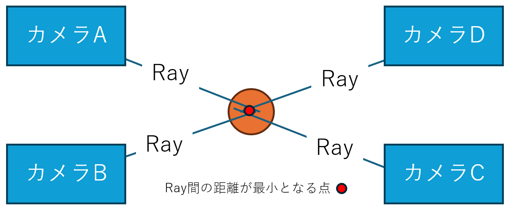
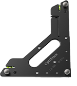
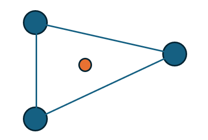
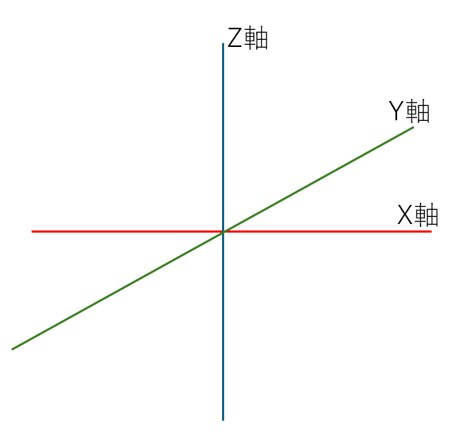
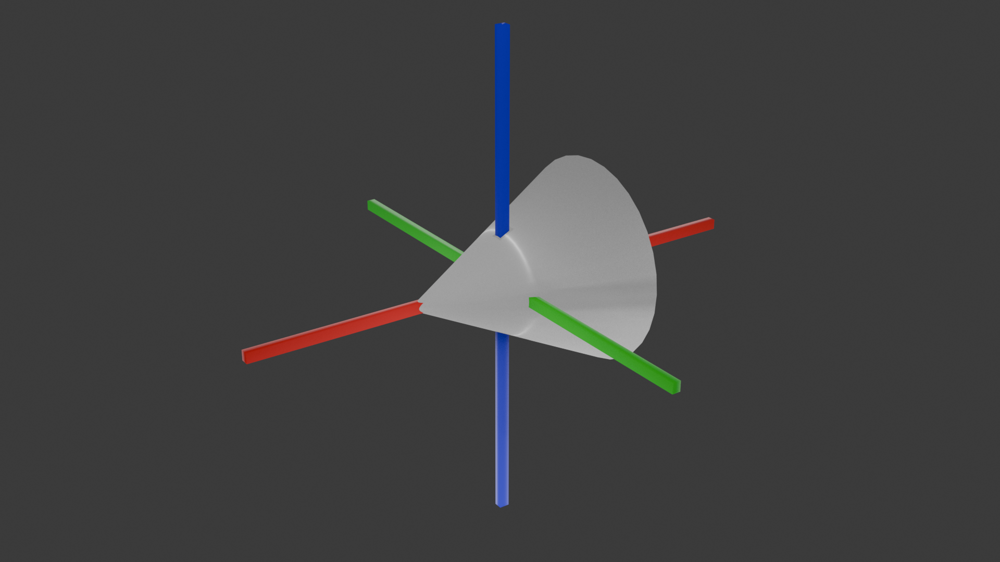
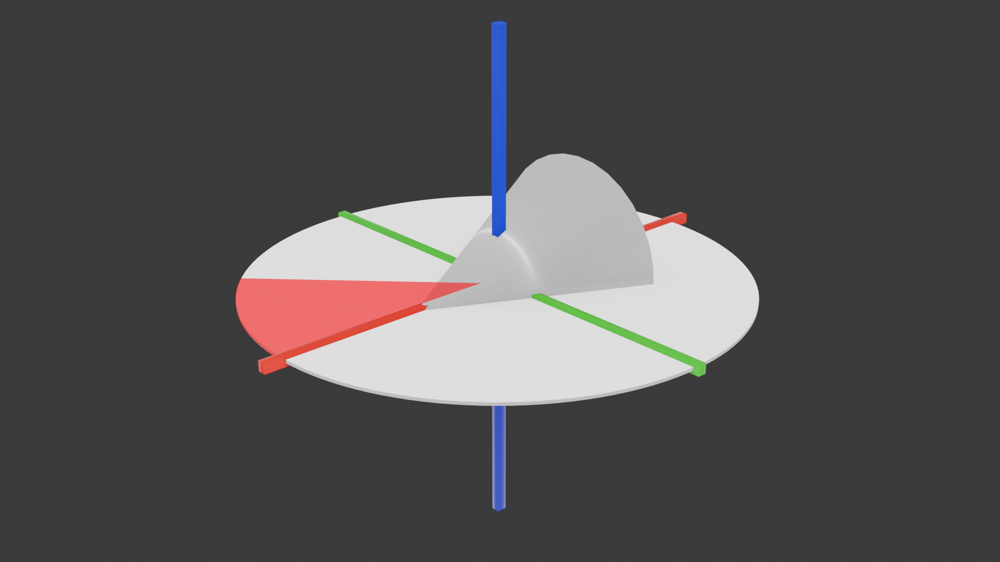
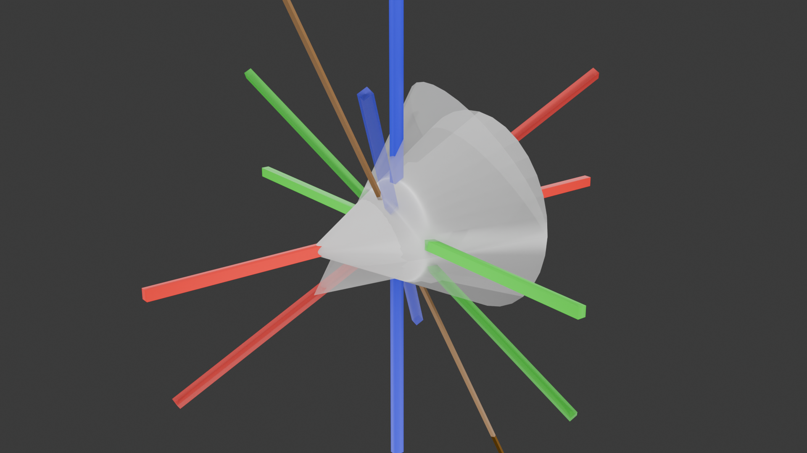
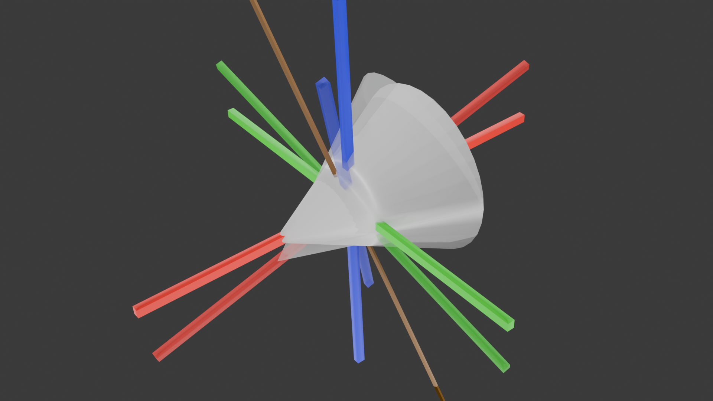
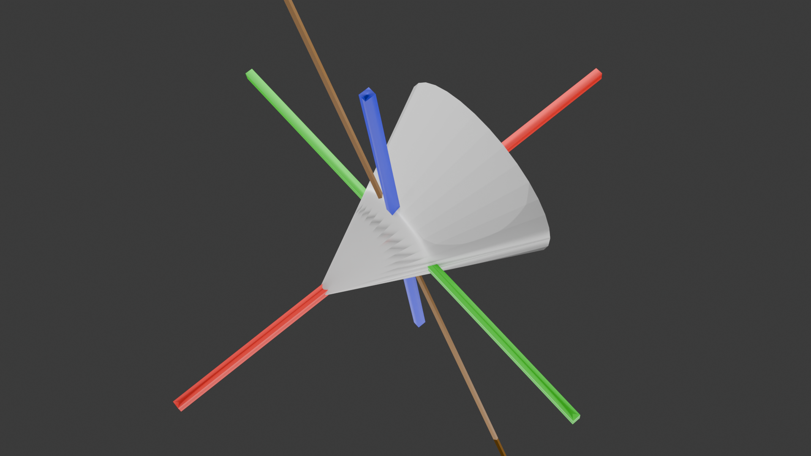
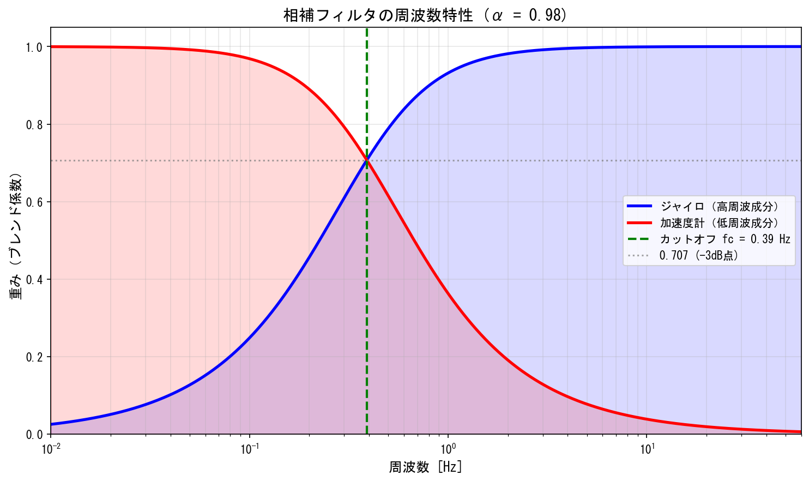

:::cover
:::

\tableofcontents
\newpage

# 緒言
## 背景

近年，モーションキャプチャ技術は，映像制作，スポーツ科学，医療・リハビリテーション，ロボティクス，ヒューマンインターフェースなど，多様な分野において広く利用されている．人体の動作を三次元空間上で計測し，骨格モデルや三次元モデルへ反映することにより，アニメーション生成や動作の定量的な評価，訓練・治療支援の高度化が可能となる．

一方，近年の動作解析では，人体の運動だけでなく，道具操作や手作業を伴う動作の理解が重要視されている．例えば，作業支援ロボットの研究，リハビリテーション動作の評価においては，人体の動きに加え，手に持つ工具や操作対象といった小型物体の運動を同時に計測することが求められる．このような小型物体を含めた動作計測は，動作全体の因果関係や操作意図を理解する上で重要な要素である[@vanani2025mesquite] [@twist]．

モーションキャプチャには複数の方式が存在するが，代表的なものとして光学式モーションキャプチャが挙げられる．光学式モーションキャプチャは，複数台のカメラによりマーカーを撮影し，その三次元座標を算出することで，高精度な絶対座標および姿勢情報を取得できるという利点を有する[@OptiTrackBaseKnowledge] [@spiceMocapAll]．しかし，小型物体を対象とした場合，十分な数のマーカーを配置することが困難であることや，手や身体による遮蔽の影響を受けやすいことから，安定した計測が困難となる．その結果，小型物体の姿勢情報が欠損しやすく，連続的な動作解析が妨げられるという課題が存在する[@spiceMocapAll]．

これに対し，慣性式モーションキャプチャは加速度センサおよびジャイロセンサを内蔵したIMUを対象に装着し，センサの情報から姿勢変化を推定する方式である．慣性式は遮蔽物の影響を受けにくく，センサを装着可能であれば連続的に姿勢変化を取得できるため，小型物体の計測に適している．一方で，角速度の時間積分による姿勢推定では誤差が蓄積しやすく，長時間計測において姿勢の信頼性が低下するという問題がある[@intertialMoCapMerit]．

光学式モーションキャプチャと慣性式モーションキャプチャを併用する研究事例[@OpticalAndInertialMoCap] [@MultiSensorHumanGaitDataset]は存在するものの，多くは人体動作の補完を主目的としたものであり，小型物体の動作計測を主目的として統合的に設計されたシステムは十分に検討されていない．

## 目的

光学式モーションキャプチャによって得られる高精度な絶対座標・姿勢情報を基準とし，慣性式モーションキャプチャによって得られる相対的な回転情報を組み合わせることで，両方式の欠点を相互に補完する統合的な計測環境を構築できれば，従来手法よりも高精度かつ安定したモーションキャプチャの実現が期待される．

本研究では，この考え方に基づき，光学式モーションキャプチャを基準とし，慣性式モーションキャプチャの手法を組み合わせた小型補助デバイスの開発を目的とする．

## 研究方針
本研究では，光学式モーションキャプチャシステムであるOptiTrackと連携可能な小型補助デバイスをSeeed Studio XIAO nRF52840を用いて開発する．本デバイスは小型物体への装着を想定した小型・軽量構成とし，搭載したIMUから小型物体の姿勢変化を推定する．

取得された小型物体の相対的な姿勢情報を，光学式モーションキャプチャによって得られる人体の絶対座標・姿勢情報と統合することで，小型物体を含めた動作を同一座標系上で扱う計測システムを構築する．これにより，遮蔽やマーカー制約によって光学式のみでは取得が困難であった小型物体の動作情報を補完する．

## 論文の構成
本論文の構成を以下に記す．

# 概要
本研究で開発するシステムは，光学式モーションキャプチャシステムOptiTrackと，IMUを搭載した小型補助デバイスを統合した構成である．光学式モーションキャプチャから取得される絶対座標・姿勢情報を親データ，補助デバイスから取得される相対的な姿勢変化を子データとして扱い，両者を同一の時間軸上で結合することで，小型物体を含めた動作計測を実現する．

補助デバイスには，3軸加速度センサおよび3軸ジャイロセンサを内蔵したSeeed Studio XIAO nRF52840を採用した．本デバイスは小型・軽量であり，小型物体への装着に適している．センサから取得した角速度および加速度データに対し，相補フィルタを用いた姿勢推定処理を施すことで，ジャイロセンサのドリフト誤差を抑制しつつ，動的な姿勢変化を追従可能とした．

OptiTrackと補助デバイス間のデータ同期には，OptiTrackのeSync2から出力される同期パルスを利用した．受信側デバイスがパルスを検知するたびにシーケンス番号をカウントアップし，このシーケンス番号を補助デバイスとの通信に付加することで，光学式と慣性式の両データを同一フレーム上で対応付ける．補助デバイスとの通信にはBluetooth Low Energy（BLE）を使用し，取得したデータはシリアル通信を介してPCへ転送される．

PC上では，OptiTrackから取得したモーションデータと補助デバイスから取得した姿勢データをシーケンス番号に基づいて統合し，Unityを用いて三次元空間上に可視化する．これにより，光学式モーションキャプチャでは取得困難であった小型物体の姿勢情報を，人体の動作と同一座標系上で表示することが可能となる．

# 光学式モーションキャプチャについて
## カメラとマーカー
光学式モーションキャプチャは，複数台の専用カメラを用いて対象の動きをキャプチャする．光学式モーションキャプチャのカメラは，赤外線を発光するストロボライトが内蔵されている．対象に取り付けるマーカーは，受けた光を直線で反射させる塗料を塗られた反射マーカーが使用される．これは，光は通常乱反射するため光源に到達する光量は小さくなるため，入射する光源の方向にのみ光を返すことで，強い光量を保つためである[@OptiTrackMarker]．

カメラから赤外線を発光し，反射した光をカメラで撮影することで，カメラから平面として見えるマーカーの座標が二次元座標で取得される．キャリブレーションにより，複数台のカメラの互いの座標と角度が定義され，キャリブレーション情報と各カメラの各マーカーに対する二次元座標をもとに，三次元座標を計算する．そのため，各マーカーは複数台のカメラのうち少なくとも2台以上のカメラから見えていることが必要となる[@OptiTrackBase]．

## キャリブレーション
光学式モーションキャプチャは三角測量の原理を用いて座標推定を行う．ある時刻において，カメラAおよびカメラBの両方に同一のマーカーが観測されたとする．このとき，各カメラからマーカーに向かってレイAおよびレイBが空間中に投射される．理想的にはこれら2本のレイは一点で交差するが，実際には観測誤差の影響により完全には交差しない．そのため，レイAとレイBの距離が最も近くなる点をマーカーの3次元座標として推定する．しかし，この手法を適用するためには，各カメラの座標および姿勢が既知である必要がある．そこで，事前にキャリブレーションを行う[@OptiTrackQuickGuide]．

キャリブレーションとは，複数台のカメラ間の相対的な座標および姿勢，焦点距離などの内部パラメータ，ならびに空間座標系における原点および座標軸の定義を行う処理を指す．本研究で使用する OptiTrack Prime 17w は，ダイナミックキャリブレーションと呼ばれる手法によってキャリブレーションが行われる[@OptiTrackQuickGuide]．

動作範囲内でマーカーを捉えることのできる座標にカメラを複数台設置し，キャリブレーションワンドと呼ばれる3つのマーカーが一列に配置されている機器([@fig:cal_wand])を用いてキャリブレーションを行う．キャリブレーションワンドに設置されたマーカーには中央のマーカーと，それぞれ距離の異なるマーカーが左右に1つずつ設置されている．機器を動作範囲内の空間中で動かすことで，各カメラのマーカーに関する2D座標が記録されていく．この時取得されたデータをもとに，各カメラのマーカーに対するレイが求められる．キャリブレーションワンド上にあるマーカー間の既知の距離関係を使用し，複数時刻にわたるデータ全体に対して再投影誤差が最小となるように最適化を行うことで，3D空間上におけるカメラ同士の相対的な座標および姿勢が推定される．この手法のことをバンドル調整(Bundle Adjustment)という[@triggs1999bundle] [@OptiTrackDoc_calibrate] [@OptiTrackBase] ([@fig:cal_point]) ．

::: {.figures height=4cm}
{#fig:cal_wand width=45%}

{#fig:cal_point}
:::

## グランドプレーン
グランドプレーンとは，計測空間における基準平面を定義する処理であり，通常は床面に対応する平面が設定される．グランドプレーンを設定することで，ワールド座標系の原点座標および各座標軸の向きが決定され，取得された三次元座標データを物理空間と対応づけることが可能となる[@OptiTrackQuickGuide] [@OptiTrackBase]．

グランドプレーンスクエアと呼ばれる機器([@fig:graund_plane_square])を原点としたい座標に設置し，複数のマーカーの三次元座標情報を用いることで，床面を一つの平面として推定する．この平面は，各マーカー座標に最も一致するように計算される．このとき，グランドプレーンスクエア上のマーカーが示す方向をZ軸（床面に対する垂直方向）として定義される．ここで定義された原点および座標軸に基づき，キャリブレーションによって得られたカメラ間の相対座標関係が再調整される．これにより，モーションキャプチャの環境が整備される．[@OptiTrackDoc_calibrate]．

::: {.figures height=3cm}
{#fig:graund_plane_square}
:::

## 剛体トラッキング
光学式モーションキャプチャでは，対象物体に3点以上のマーカーを取り付け，それらを一つの剛体（Rigid Body）([@fig:rigid-image]) として定義することで，物体の座標および姿勢を推定する手法が用いられる．

まず，各マーカーの三次元座標は複数カメラによる三角測量によって算出される．次に，マーカー間の相対座標関係が時間的に変化しないという仮定のもと，これらのマーカー群を一つの剛体として扱う．各時刻におけるマーカー配置と基準配置との対応関係から，剛体の並進および回転が推定される．これを剛体トラッキングと呼ぶ[@OptiTrackDoc_rigidbody]．

剛体が定義されたとき，どのマーカーがどの剛体に対応するかに加え，各マーカー間の距離や相対的な配置から求められる剛体の形状が保存される．それ以降は，このマーカー間の距離と剛体の形状に一致するものをフレームごとに探索することで，どのマーカーが剛体に対応するかを決定する．その後，剛体の重心を計算し，この重心をもとに各フレームごとに剛体をどれほど移動させ，回転させるべきかを計算する[@fomula-rigid]．

これにより，対象物体の座標と姿勢が推定される．

{#fig:rigid-image width=30%}

# 慣性式モーションキャプチャ
## 回転の表し方

### 角速度ベクトル
角速度ベクトル $\vec{\omega}$ とは，物体の瞬間的な回転軸方向と回転角速度の大きさを同時に表すベクトル（[@eq:angular_vec]）であり，回転運動を3つの軸成分に分解して表現したものである．[@diebel2006representing]
その大きさは回転角速度を，向きは瞬間回転軸を表す（[@fig:angular_vec_img]）．

例えば，$\vec{\omega} = [1, 0, 0]$ のとき，x軸周りに $1[\mathrm{rad/s}]$ で回転していることを意味する．
慣性式モーションキャプチャなどでは，IMUの出力データを表現する際に用いられる．

$$
\vec{\omega}=[\omega_x,\omega_y,\omega_z]\ [\mathrm{rad/s}]
$${#eq:angular_vec}

{#fig:angular_vec_img width=30%}

### オイラー角
オイラー角とは，回転を3つの角度によって表現する方法であり，物体の姿勢を直感的に理解しやすいという特徴を持つ姿勢表現法である．一般に回転は，あらかじめ定められた3軸に対して順番に行われ，各回転角の組によって姿勢が定義される．

代表的な表現として Z-Y-X 系（[@fig:euler_init_1]）があり，これはz軸周りの回転をYaw（[@fig:euler_yaw_1]），y軸周りの回転をPitch（[@fig:euler_pitch_1]），x軸周りの回転を Roll（[@fig:euler_roll_1]）とし，この順に回転を適用するものである [@diebel2006representing]．

::: {.figures}
{#fig:euler_init_1 width=40%}
{#fig:euler_yaw_1 width=40%}
{#fig:euler_pitch_1 width=40%}
{#fig:euler_roll_1 width=40%}
:::

オイラー角は，3つのパラメータのみで姿勢を表現できるため計算量が少ないという利点を有する．一方で，特定の姿勢において自由度が失われるジンバルロックと呼ばれる問題が発生するという欠点がある．

オイラー角は  
$$
\boldsymbol{\Theta} = (\phi,\ \theta,\ \psi)\ [\mathrm{rad}]
$$
として表す．ここで，$\phi$ は Roll 角，$\theta$ は Pitch 角，$\psi$ は Yaw 角を表す [@diebel2006representing]．

$\boldsymbol{\Theta} = (0,\ \frac{\pi}{2},\ 0)$ のとき，Roll と Yaw の回転軸が一致し，2つの回転が独立に定義できなくなる．このように回転の自由度が1つ失われる姿勢を 特異姿勢 と呼び，この現象をジンバルロックという．

### 回転行列
回転行列とは，姿勢を線形変換として表現する方法であり，座標変換の観点から姿勢を厳密に記述できる姿勢表現法である．

回転行列は $3\times 3$ の正方行列で表され，物体座標系から固定座標系への変換に用いられる．また，直交行列の性質より逆変換は
$$
\mathbf{R}^{-1}=\mathbf{R}^{\mathrm{T}}
$$
によって与えられる [@diebel2006representing]．

回転行列 $\mathbf{R}$ は以下の性質を満たす直交行列である（[@eq:roll_vec]）．ここで，$\mathbf{I}$ は単位行列を表す．

$$
\mathbf{R}^{\mathrm{T}}\mathbf{R}=\mathbf{I},\quad \det(\mathbf{R})=1
$${#eq:roll_vec}

x，y，z 各軸周りの回転行列は，右手系座標系において正方向から見て反時計回りに回転させる変換として，次のように定義される [@diebel2006representing]．

x軸周りの回転行列（[@eq:roll_vec_x]）
$$
\mathbf{R}_x(\phi)=
\begin{pmatrix}
1 & 0 & 0 \\
0 & \cos{\phi} & -\sin{\phi} \\
0 & \sin{\phi} & \cos{\phi}
\end{pmatrix}
$${#eq:roll_vec_x}

y軸周りの回転行列（[@eq:roll_vec_y]）
$$
\mathbf{R}_y(\theta)=
\begin{pmatrix}
\cos{\theta} & 0 & \sin{\theta} \\
0 & 1 & 0 \\
-\sin{\theta} & 0 & \cos{\theta}
\end{pmatrix}
$${#eq:roll_vec_y}

z軸周りの回転行列（[@eq:roll_vec_z]）
$$
\mathbf{R}_z(\psi)=
\begin{pmatrix}
\cos{\psi} & -\sin{\psi} & 0 \\
\sin{\psi} & \cos{\psi} & 0 \\
0 & 0 & 1
\end{pmatrix}
$${#eq:roll_vec_z}

Z-Y-X 系オイラー角を用いる場合，回転行列は各軸回転行列の積として次式で表される（[@eq:euler_roll_vec]）．

$$
\mathbf{R}=\mathbf{R}_z(\psi)\mathbf{R}_y(\theta)\mathbf{R}_x(\phi)
$${#eq:euler_roll_vec}

このとき，回転の適用順序は右から左であり，まず x-Roll 軸回転，次に y-Pitch 軸回転，最後に z-Yaw 軸回転が適用される．  
回転行列自体には特異点は存在しないが，オイラー角との相互変換においては，不安定性が生じることがある．

### クォータニオン
クォータニオンは，三次元空間における回転を4つの実数成分によって表現する姿勢表現法である（[@eq:Quaternion]）．オイラー角や回転行列と同様に物体の姿勢を表すことができるが，特異点（ジンバルロック）を持たず，数値的に安定であるという特徴を有する [@diebel2006representing]．

$$
q=w+xi+yj+zk
$${#eq:Quaternion}

ここで，$w$ は実部，$x,y,z$ は虚部，$i,j,k$ は四元数における虚数単位である．虚数単位の性質は次式で与えられる（[@eq:imaginary-number-rule]）．

$$
i^2=j^2=k^2=ijk=-1
$${#eq:imaginary-number-rule}

クォータニオンは次のようにスカラー部とベクトル部に分けて表すことができる．

$$
q=(w,\vec{v}_q), \qquad \vec{v}_q=(x,y,z)
$${#eq:Quaternion_scaler}

回転を表す単位クォータニオンは，回転角 $\theta$ と回転軸 $\vec{u}$ を用いて次式で表される．

$$
q=(\cos\frac{\theta}{2},\ \vec{u}\sin\frac{\theta}{2})
$${#eq:Quaternion_union}

ここで，$\vec{u}$ は大きさ1の単位ベクトルである．

三次元空間ベクトル $\vec{a}=(a_x,a_y,a_z)$ を回転させる場合，これを実部0の 純虚クォータニオン 
$$
v=(0,a_x,a_y,a_z)
$$
として表し，次式により回転を行う．

$$
v' = q v q^{-1}
$${#eq:Quaternion_roll_base}

単位クォータニオンにおいて，回転角 $\theta$ は
$$
\theta = 2\arccos(w)
$${#eq:unit_Quaternion_theta}
より求められ，回転軸は
$$
\vec{u}=\frac{(x,y,z)}{\sqrt{1-w^2}}
$${#eq:unit_Quaternion_u}
として得られる [@diebel2006representing]．

このことから，クォータニオン回転は「回転軸 $\vec{u}$ の周りに角度 $\theta$ 回転する操作」に対応していることが分かる．

さらに，クォータニオンを用いることで，球面線形補間（SLERP）により角速度の不連続を生じることなく連続的な姿勢遷移を実現できる．

一方，クォータニオンによる回転は [@fig:Quaternion_1]～[@fig:Quaternion_3] に示すように，一つの回転軸を基準として行われる．

::: {.figures}
{#fig:Quaternion_1 width=30%}
{#fig:Quaternion_2 width=30%}
{#fig:Quaternion_3 width=30%}
:::

### オイラー角(ZYK)からクォータニオンへの変換
今回の座標系は右手系で，回転順序をZYX(Yaw→Pitch→Roll)である．この時，YawはZ軸回り，PitchはY軸回り，RollはX軸回りである．合成回転を([@eq:join_roll])とする．

$$
R = R_z(\psi)\,R_y(\theta)\,R_x(\phi)
$${#eq:join_roll}

半角の三角関数は([@eq:phi_function]),([@eq:theta_function]),([@eq:psi_function])のように示される．
$$
c_\phi=\cos\left(\frac{\phi}{2}\right),\quad
s_\phi=\sin\left(\frac{\phi}{2}\right)
$${#eq:phi_function}

$$
c_\theta=\cos\left(\frac{\theta}{2}\right),\quad
s_\theta=\sin\left(\frac{\theta}{2}\right)
$${#eq:theta_function}

$$
c_\psi=\cos\left(\frac{\psi}{2}\right),\quad
s_\psi=\sin\left(\frac{\psi}{2}\right)
$${#eq:psi_function}

この時，クォータニオンは([@eq:fomula_quaternion])で求められる．
$$
\begin{aligned}
&w = c_\psi c_\theta c_\phi + s_\psi s_\theta s_\phi \\
&x = c_\psi c_\theta s_\phi - s_\psi s_\theta c_\phi \\
&y = c_\psi s_\theta c_\phi + s_\psi c_\theta s_\phi \\
&z = s_\psi c_\theta c_\phi - c_\psi s_\theta s_\phi \\
\end{aligned}
$${#eq:fomula_quaternion}

## 6軸IMUから角度を取得する基本的な計算手法

6軸IMU（Inertial Measurement Unit）は，3軸ジャイロセンサと3軸加速度センサから構成されており，角速度および並進加速度を同時に計測できる．  
慣性式モーションキャプチャでは，これらの出力を統合することで各センサの姿勢推定を行う．

### ジャイロセンサによる姿勢推定

ジャイロセンサは，各軸周りの角速度ベクトル

$$
\vec{\omega}(t) = (\omega_x,\omega_y,\omega_z)
$$

を出力する．  
この角速度を時間積分することで姿勢の時間変化を推定できる．

クォータニオンを用いる場合，姿勢の時間微分は次式で表される．

$$
\dot{q}(t) = \frac{1}{2} q(t) \otimes \Omega(t)
$$

ここで，

$$
\Omega(t) = (0,\omega_x,\omega_y,\omega_z)
$$

は角速度を純虚クォータニオンとして表したものである．

離散時間系において，サンプリング周期を $\Delta t$ とすると，姿勢更新は

$$
q_{k+1} = q_k \otimes
\left(
\cos\frac{|\vec{\omega}_k|\Delta t}{2},
\frac{\vec{\omega}_k}{|\vec{\omega}_k|}\sin\frac{|\vec{\omega}_k|\Delta t}{2}
\right)
$$

として近似的に計算される．

この方法は短時間では高精度であるが，ジャイロバイアスやノイズにより時間経過とともに誤差が蓄積するドリフト問題を有する．

 

### 加速度センサによる姿勢推定

加速度センサは

$$
\vec{a} = (a_x,a_y,a_z)
$$

を出力する．  
静止状態または等速直線運動時には，観測される加速度は重力加速度のみとなる．

この性質を利用することで，重力方向を基準とした姿勢推定が可能となる．  
Roll角およびPitch角は次式で与えられる．

$$
\phi = \arctan2(a_y, a_z)
$$

$$
\theta = \arctan2(-a_x,\sqrt{a_y^2+a_z^2})
$$

加速度センサによる姿勢推定はドリフトを生じないが，運動中には並進加速度の影響を強く受けるため，動的環境下では精度が低下する．  
また，Yaw角は重力情報のみからは推定できない．

なお，ジャイロセンサは短時間(高周波成分)の精度が高いが，ドリフトが発生し得る．一方，加速度センサは長時間(低周波成分)の精度が高いが，高速な運動時に不安定となる．そのため相補フィルタを使用する必要がある．

# nRF52840を用いた角度の取得方法
今回使用するnRF52840は，ジャイロセンサと加速度センサが搭載されている．そのため，以下のような手法で現在の角度を取得することとした．

## キャリブレーション
ジャイロセンサを使用するにあたり，現在のジャイロに対するバイアスを測定し，除かなければならないため([@eq:cal_gyro_bias])のように計算し推定する．

$$
\begin{aligned}
& \text{ジャイロセンサから取得できるデータを} gyro\_data=(g_x,g_y,g_z)\text{としたとき}\\
& gyro\_bias=(\Sigma{g_x/count},\Sigma{g_y/count},\Sigma{g_z/count})\\
\end{aligned}
$${#eq:cal_gyro_bias}

nRF52840のサンプリングレートに関して，今回使用する光学式モーションキャプチャのサンプリングレートである120Hzに合わる．また，ジャイロセンサのキャリブレーションに関しては2.0秒行うものとするため，理論上のサンプル数$count$は，240となる．ただし，通信によるデータロスなどが起こりサンプル数が10を下回った場合，十分なサンプルがなく誤ったバイアスを推定する可能性があるため，この場合はバイアスなしとして処理を行う．

Roll並びにPitchの初期姿勢を推定する([@eq:cal_accel])．

$$
\begin{aligned}
& \text{加速度センサから取得できるデータを} \\ 
& accel\_data=(a_x,a_y,a_z)\text{としたとき}\\
& accel\_mean=(\Sigma{a_x/count},\Sigma{a_y/count},\Sigma{a_z/count})\\
& roll_0=\arctan2(accel\_mean_y,accel\_mean_z) \\
& pitch_0=\arctan2(-ax,\sqrt{({accel\_mean_y}^2,{accel\_mean_z}^2)})\\
& yaw_0=0\\
& \text{なお，この時}\arctan2\text{は}\\
& \arctan2(y,x) \text{のとき，} -\pi<\theta\le\pi\text{の範囲で}\\
& x=r\cos\theta\\
& y=r\sin\theta\\
& r=\sqrt{x^2+y^2}\\
& \text{ただし}r>0\text{となる単一の値}\theta\text{を返す関数である．}
\end{aligned}
$${#eq:cal_accel}

なお，この時nRF52840は停止しているものとし，サンプル数$count$はジャイロセンサのキャリブレーションと同様のものであるとする．

## バイアス補正，単位変換
バイアスを毎回除去するとき([@eq:gyro_sub_bias])のように行なう．

$$
\begin{aligned}
& gyro\_current=(g_x-gyro\_bias.x,g_y-gyro\_bias.y,g_z-gyro\_bias.z)
\end{aligned}
$${#eq:gyro_sub_bias}

また，単位を変換させるとき([@eq:rad2rads])のように計算する．

$$
\begin{aligned}
\omega=gyro\_current\cdot\frac{\pi}{180} [rad/s]
\end{aligned}
$${#eq:rad2rads}

## 姿勢推定
### 高周波成分(ジャイロ)の姿勢更新
ジャイロセンサから取得できるデータを$\frac{1}{サンプリングレート}$で更新する．回転量は([@eq:get_gyro])で計算される．
$$
\begin{aligned}
& \Delta \vec{\theta} = \vec{\omega} \cdot dt \\
& \theta = \sqrt{
  (\Delta\theta_x)^2 +
(\Delta\theta_y)^2 +
(\Delta\theta_z)^2}\\
& \text{回転軸ベクトルは}\\
&\vec{u} =
\frac{1}{\theta}
\begin{bmatrix}
\Delta\theta_x \\
\Delta\theta_y \\
\Delta\theta_z
\end{bmatrix}\\
& \text{クォータニオンは}\\
& dq =
\begin{bmatrix}
\cos(\theta/2) \\
u_x \sin(\theta/2) \\
u_y \sin(\theta/2) \\
u_z \sin(\theta/2)
\end{bmatrix}\\
& \text{と定義される．}\\
& q_{\mathrm{gyro}}=\mathrm{normalize}(q_{current} \otimes dq)\\
& \text{で高周波成分のクォータニオンが得られる．}
\end{aligned}
$${#eq:get_gyro}

### 低周波成分(加速度)の姿勢更新
加速度から取得できるデータを$\frac{1}{サンプリングレート}$で更新する．回転量は([@eq:get_accel])で計算される．

$$
\begin{aligned}
& roll\_accel = \arctan2(a_y, a_z)\\
& pitch\_accel = \arctan2(-a_x,\sqrt{a_y^2 + a_z^2})\\
& yaw\_accel = yaw\_gyro\\
\end{aligned}
$${#eq:get_accel}

### クォータニオン化
加速度によって得られるオイラー角をクォータニオンへ([@eq:accel2quater])変換する．

$$
q\_accel=\text{Quaternion}(roll\_accel,pitch\_accel,yaw\_accel)
$${#eq:accel2quater}

## 相補フィルタで融合
高周波の場合はジャイロセンサからのデータを，低周波の場合は加速度センサからのデータを採用するため([@eq:nlerp])，以下のようなフィルタで融合させる([@fig:nlerp_filter])．今回$\alpha=0.98$とする．

$$
q=\mathrm{nlerp}(q_{\mathrm{gyro}},q_{\mathrm{accel}},t=1-\alpha)
$${#eq:nlerp}

::: {.figures}
{#fig:nlerp_filter width=50%}
:::

## 加速度の信頼性判定
加速度センサから得られる姿勢情報は，静止時または等速直線運動時には重力方向を正しく示すが，動的な運動中には並進加速度の影響を受け信頼性が低下する．そこで，加速度のノルムを用いた信頼性判定を行う([@eq:accel_norm_check])．

$$
\begin{aligned}
& \|\vec{a}\| = \sqrt{a_x^2 + a_y^2 + a_z^2}\\
& \text{もし } 0.5 < \|\vec{a}\| < 1.5 \text{ [G] のとき，加速度データを使用}\\
& \text{そうでない場合，ジャイロのみで姿勢更新}
\end{aligned}
$${#eq:accel_norm_check}

なお，静止時の加速度ノルムは重力加速度の$1.0$[G]となる．しきい値を$0.5$～$1.5$[G]とすることで，急激な運動や衝撃が加わった際には加速度センサの情報を無視し，ジャイロセンサのみによる姿勢更新を行う．これにより，動的環境下における姿勢推定の安定性を向上させる．

以上の処理により，120HzでnRF52840の現在の姿勢を推定することができる．

# 光学式モーションキャプチャとの同期
今回使用しているOptiTrackとnRF52840は別のデバイスで，同期機能を実装しなければ収録されたデータを同期して再生することができないため，以下のように同期機能を実装した．

\newpage

# 参考文献