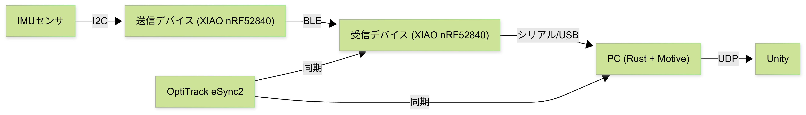
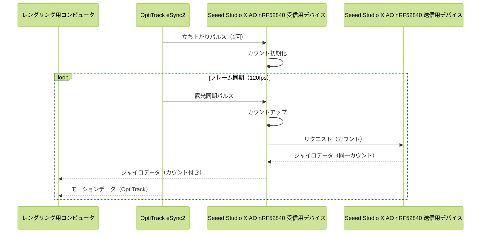
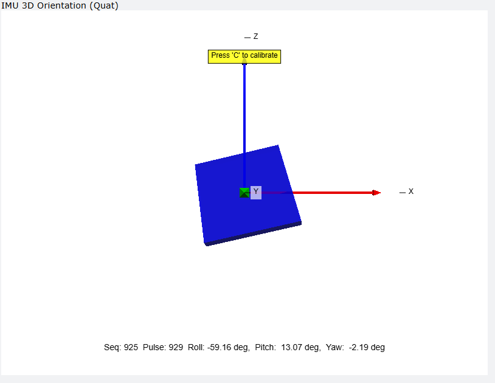
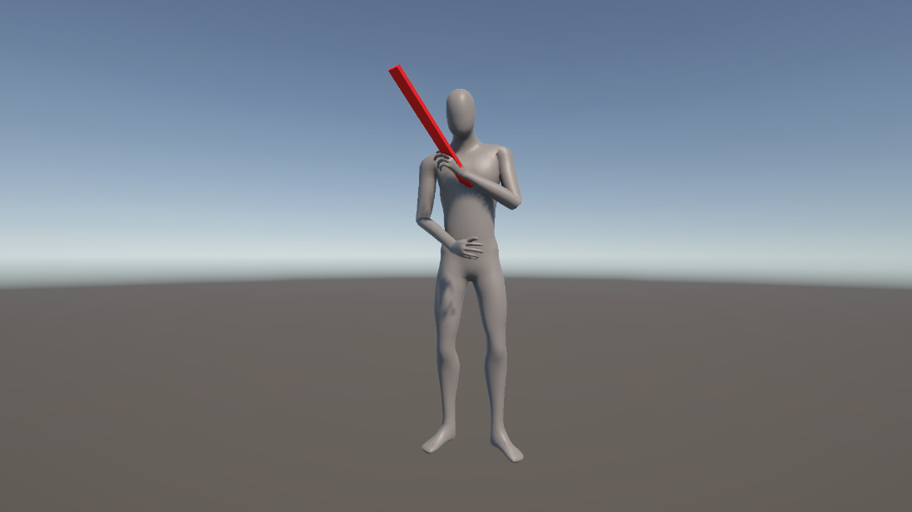

<style>
p {
  padding-left: 1em;
  text-indent: -1em;
}
li > p {
  padding-left: 0;
  text-indent: 0;
}
</style>

:::cover
:::

\tableofcontents
\newpage

# 緒言
## 背景

近年，モーションキャプチャ技術は，映像制作，スポーツ科学，医療・リハビリテーション，ロボティクス，ヒューマンインターフェースなど，多様な分野において広く利用されている．人体の動作を三次元空間上で計測し，骨格モデルや三次元モデルへ反映することにより，アニメーション生成や動作の定量的な評価，訓練・治療支援の高度化が可能となる．

一方，近年の動作解析では，人体の運動だけでなく，道具操作や手作業を伴う動作の理解が重要視されている．例えば，作業支援ロボットの研究，リハビリテーション動作の評価においては，人体の動きに加え，手に持つ工具や操作対象といった小型物体の運動を同時に計測することが求められる．このような小型物体を含めた動作計測は，動作全体の因果関係や操作意図を理解する上で重要な要素である[@vanani2025mesquite] [@twist]．

モーションキャプチャには複数の方式が存在するが，代表的なものとして光学式モーションキャプチャが挙げられる．光学式モーションキャプチャは，複数台のカメラによりマーカーを撮影し，その三次元座標を算出することで，高精度な絶対座標および姿勢情報を取得できるという利点を有する[@OptiTrackBaseKnowledge] [@spiceMocapAll]．しかし，小型物体を対象とした場合，十分な数のマーカーを配置することが困難であることや，手や身体による遮蔽の影響を受けやすいことから，安定した計測が困難となる．その結果，小型物体の姿勢情報が欠損しやすく，連続的な動作解析が妨げられるという課題が存在する[@spiceMocapAll]．

これに対し，慣性式モーションキャプチャは加速度センサおよびジャイロセンサを内蔵したIMUを対象に装着し，センサの情報から姿勢変化を推定する方式である．慣性式は遮蔽物の影響を受けにくく，センサを装着可能であれば連続的に姿勢変化を取得できるため，小型物体の計測に適している．一方で，角速度の時間積分による姿勢推定では誤差が蓄積しやすく，長時間計測において姿勢の信頼性が低下するという問題がある[@intertialMoCapMerit]．

光学式モーションキャプチャと慣性式モーションキャプチャを併用する研究事例[@OpticalAndInertialMoCap] [@MultiSensorHumanGaitDataset]は存在するものの，多くは人体動作の補完を主目的としたものであり，小型物体の動作計測を主目的として統合的に設計されたシステムは十分に検討されていない．

## 目的

光学式モーションキャプチャによって得られる高精度な絶対座標・姿勢情報を基準とし，慣性式モーションキャプチャによって得られる相対的な回転情報を組み合わせることで，両方式の欠点を相互に補完する統合的な計測環境を構築できれば，従来手法よりも高精度かつ安定したモーションキャプチャの実現が期待される．

本研究では，この考え方に基づき，光学式モーションキャプチャを基準とし，慣性式モーションキャプチャの手法を組み合わせた小型補助デバイスの開発を目的とする．

## 研究方針
本研究では，光学式モーションキャプチャシステムである OptiTrackと連携可能な小型補助デバイスをSeeed Studio XIAO nRF52840を用いて開発する．本デバイスは小型物体への装着を想定した小型・軽量構成とし，搭載したIMUから小型物体の姿勢変化を推定する．

取得された小型物体の相対的な姿勢情報を，光学式モーションキャプチャによって得られる人体の絶対座標・姿勢情報と統合することで，小型物体を含めた動作を同一座標系上で扱う計測システムを構築する．これにより，遮蔽やマーカー制約によって光学式のみでは取得が困難であった小型物体の動作情報を補完する．

## 論文の構成
本論文の構成を以下に記す．

本研究で開発するシステムの全体概要とデータフローに関して，[@sec:overview]で述べる．

光学式モーションキャプチャの原理に関して，カメラとマーカーの仕組み，キャリブレーション，グランドプレーン，剛体トラッキングの観点から[@sec:optical]で説明する．

慣性式モーションキャプチャに必要な回転の表現方法に関して，角速度ベクトル，オイラー角，回転行列，クォータニオンの各表現法と，6軸IMUを用いた姿勢推定の基本的な計算手法について[@sec:inertial]で述べる．

Seeed Studio XIAO nRF52840を用いた角度取得の具体的な実装方法に関して，キャリブレーション，バイアス補正，姿勢推定，相補フィルタによる融合処理を[@sec:xiao]で説明する．

開発した補助デバイスの仕様に関して，OptiTrack eSync2との同期機能，Bluetooth通信およびシリアル通信の仕様を[@sec:device]で詳述する．

レンダリング用コンピュータ上で動作する姿勢推定プログラムの実装に関して，[@sec:rendering]で述べる．

VPythonを用いたリアルタイム3D可視化ツールに関して，[@sec:visualization]で説明する．

開発したシステムの実験および評価結果に関して，[@sec:experiment]で述べる．

本研究のまとめと今後の課題に関して，[@sec:conclusion]で述べる．

# 概要 {#sec:overview}
本研究で開発するシステムは，光学式モーションキャプチャシステム OptiTrackと，IMUを搭載した小型補助デバイスを統合した構成である．光学式モーションキャプチャから取得される絶対座標・姿勢情報を親データ，補助デバイスから取得される相対的な姿勢変化を子データとして扱い，両者を同一の時間軸上で結合することで，小型物体を含めた動作計測を実現する．

システム全体のデータフローを[@fig:mermaid_gaiyo]に示す．

::: {.figures height=4cm}
{#fig:mermaid_gaiyo}
:::

補助デバイスには，3軸加速度センサおよび3軸ジャイロセンサを内蔵したSeeed Studio XIAO nRF52840を採用した．本デバイスは小型・軽量であり，小型物体への装着に適している．センサから取得した角速度および加速度データに対し，相補フィルタを用いた姿勢推定処理を施すことで，ジャイロセンサのドリフト誤差を抑制しつつ，動的な姿勢変化を追従可能とした．

 OptiTrackと補助デバイス間のデータ同期には，OptiTrackのeSync2から出力される同期パルスを利用した．受信側デバイスがパルスを検知するたびにシーケンス番号をカウントアップし，このシーケンス番号を補助デバイスとの通信に付加することで，光学式と慣性式の両データを同一フレーム上で対応付ける．補助デバイスとの通信にはBluetooth Low Energy（BLE）を使用し，取得したデータはシリアル通信を介してPCへ転送される．

PC上では，OptiTrackから取得したモーションデータと補助デバイスから取得した姿勢データをシーケンス番号に基づいて統合し，Unityを用いて三次元空間上に可視化する．これにより，光学式モーションキャプチャでは取得困難であった小型物体の姿勢情報を，人体の動作と同一座標系上で表示することが可能となる．

# 光学式モーションキャプチャについて {#sec:optical}
## カメラとマーカー
光学式モーションキャプチャは，複数台の専用カメラを用いて対象の動きをキャプチャする．光学式モーションキャプチャのカメラは，赤外線を発光するストロボライトが内蔵されている．対象に取り付けるマーカーは，入射光を光源方向へ高効率に反射する再帰反射材が用いられる．これは，光は通常乱反射するため光源に到達する光量は小さくなるため，入射する光源の方向にのみ光を返すことで，強い光量を保つためである[@OptiTrackMarker]．

カメラから赤外線を発光し，反射した光をカメラで撮影することで，カメラから平面として見えるマーカーの座標が二次元座標で取得される．キャリブレーションにより，複数台のカメラの互いの座標と角度が定義され，キャリブレーション情報と各カメラの各マーカーに対する二次元座標をもとに，三次元座標を計算する．そのため，各マーカーは複数台のカメラのうち少なくとも2台以上のカメラから見えていることが必要となる[@OptiTrackBase]．

## キャリブレーション
光学式モーションキャプチャは三角測量の原理を用いて座標推定を行う．ある時刻において，カメラAおよびカメラBの両方に同一のマーカーが観測されたとする．このとき，各カメラからマーカーに向かってレイAおよびレイBが空間中に投射される．理想的にはこれら2本のレイは一点で交差するが，実際には観測誤差の影響により完全には交差しない．そのため，レイAとレイBの距離が最も近くなる点をマーカーの3次元座標として推定する．しかし，この手法を適用するためには，各カメラの座標および姿勢が既知である必要がある．そこで，事前にキャリブレーションを行う[@OptiTrackQuickGuide]．

キャリブレーションとは，複数台のカメラ間の相対的な座標および姿勢，焦点距離などの内部パラメータ，ならびに空間座標系における原点および座標軸の定義を行う処理を指す．本研究で使用する OptiTrack Prime 17w は，ダイナミックキャリブレーションと呼ばれる手法によってキャリブレーションが行われる[@OptiTrackQuickGuide]．

動作範囲内でマーカーを捉えることのできる座標にカメラを複数台設置し，キャリブレーションワンドと呼ばれる3つのマーカーが一列に配置されている機器([@fig:cal_wand])を用いてキャリブレーションを行う．キャリブレーションワンドに設置されたマーカーには中央のマーカーと，それぞれ距離の異なるマーカーが左右に1つずつ設置されている．機器を動作範囲内の空間中で動かすことで，各カメラのマーカーに関する2D座標が記録されていく．この時取得されたデータをもとに，各カメラのマーカーに対するレイが求められる．キャリブレーションワンド上にあるマーカー間の既知の距離関係を使用し，複数時刻にわたるデータ全体に対して再投影誤差が最小となるように最適化を行うことで，3D空間上におけるカメラ同士の相対的な座標および姿勢が推定される．この手法のことをバンドル調整(Bundle Adjustment)という[@triggs1999bundle] [@OptiTrackDoc_calibrate] [@OptiTrackBase] ([@fig:cal_point]) ．


::: {.figures height=4cm}
{#fig:cal_wand width=45%}

{#fig:cal_point}
:::

## グランドプレーン
グランドプレーンとは，計測空間における基準平面を定義する処理であり，通常は床面に対応する平面が設定される．グランドプレーンを設定することで，ワールド座標系の原点座標および各座標軸の向きが決定され，取得された三次元座標データを物理空間と対応づけることが可能となる[@OptiTrackQuickGuide] [@OptiTrackBase]．

グランドプレーンスクエアと呼ばれる機器([@fig:graund_plane_square])を原点としたい座標に設置し，複数のマーカーの三次元座標情報を用いることで，床面を一つの平面として推定する．この平面は，各マーカー座標に最も一致するように計算される．このとき，グランドプレーンスクエア上のマーカーが示す方向をZ軸（床面に対する垂直方向）として定義される．ここで定義された原点および座標軸に基づき，キャリブレーションによって得られたカメラ間の相対座標関係が再調整される．これにより，モーションキャプチャの環境が整備される．[@OptiTrackDoc_calibrate]．

::: {.figures height=3cm}
{#fig:graund_plane_square}
:::

## 剛体トラッキング
光学式モーションキャプチャでは，対象物体に3点以上のマーカーを取り付け，それらを一つの剛体（Rigid Body）([@fig:rigid-image]) として定義することで，物体の座標および姿勢を推定する手法が用いられる．

まず，各マーカーの三次元座標は複数カメラによる三角測量によって算出される．次に，マーカー間の相対座標関係が時間的に変化しないという仮定のもと，これらのマーカー群を一つの剛体として扱う．各時刻におけるマーカー配置と基準配置との対応関係から，剛体の並進および回転が推定される．これを剛体トラッキングと呼ぶ[@OptiTrackDoc_rigidbody]．

剛体が定義されたとき，どのマーカーがどの剛体に対応するかに加え，各マーカー間の距離や相対的な配置から求められる剛体の形状が保存される．それ以降は，このマーカー間の距離と剛体の形状に一致するものをフレームごとに探索することで，どのマーカーが剛体に対応するかを決定する．その後，剛体の重心を計算し，この重心をもとに各フレームごとに剛体をどれほど移動させ，回転させるべきかを計算する[@fomula-rigid]．

これにより，対象物体の座標と姿勢が推定される．

{#fig:rigid-image width=30%}

# 慣性式モーションキャプチャ {#sec:inertial}
## 回転の表し方

### 角速度ベクトル
角速度ベクトル $\vec{\omega}$ とは，物体の瞬間的な回転軸方向と回転角速度の大きさを同時に表すベクトル（[@eq:angular_vec]）であり，回転運動を3つの軸成分に分解して表現したものである．[@diebel2006representing]
その大きさは回転角速度を，向きは瞬間回転軸を表す（[@fig:angular_vec_img]）．

例えば，$\vec{\omega} = [1, 0, 0]$ のとき，x軸周りに $1[\mathrm{rad/s}]$ で回転していることを意味する．
慣性式モーションキャプチャなどでは，IMUの出力データを表現する際に用いられる．

$$
\vec{\omega}=[\omega_x,\omega_y,\omega_z]\ [\mathrm{rad/s}]
$${#eq:angular_vec}

{#fig:angular_vec_img width=30%}


### オイラー角
オイラー角とは，回転を3つの角度によって表現する方法であり，物体の姿勢を直感的に理解しやすいという特徴を持つ姿勢表現法である．一般に回転は，あらかじめ定められた3軸に対して順番に行われ，各回転角の組によって姿勢が定義される．

代表的な表現として Z-Y-X 系（[@fig:euler_init_1]）があり，これはz軸周りの回転をYaw（[@fig:euler_yaw_1]），y軸周りの回転をPitch（[@fig:euler_pitch_1]），x軸周りの回転を Roll（[@fig:euler_roll_1]）とし，この順に回転を適用するものである [@diebel2006representing]．

::: {.figures}
{#fig:euler_init_1 width=40%}
{#fig:euler_yaw_1 width=40%}
{#fig:euler_pitch_1 width=40%}
{#fig:euler_roll_1 width=40%}
:::

オイラー角は，3つのパラメータのみで姿勢を表現できるため計算量が少ないという利点を有する．一方で，特定の姿勢において自由度が失われるジンバルロックと呼ばれる問題が発生するという欠点がある．

オイラー角は  
$$
\boldsymbol{\Theta} = (\phi,\ \theta,\ \psi)\ [\mathrm{rad}]
$$
として表す．ここで，$\phi$ は Roll 角，$\theta$ は Pitch 角，$\psi$ は Yaw 角を表す [@diebel2006representing]．

$\boldsymbol{\Theta} = (0,\ \frac{\pi}{2},\ 0)$ のとき，Roll と Yaw の回転軸が一致し，2つの回転が独立に定義できなくなる．このように回転の自由度が1つ失われる姿勢を 特異姿勢 と呼び，この現象をジンバルロックという．

### 回転行列
回転行列とは，姿勢を線形変換として表現する方法であり，座標変換の観点から姿勢を厳密に記述できる姿勢表現法である．

回転行列は $3\times 3$ の正方行列で表され，物体座標系から固定座標系への変換に用いられる．また，直交行列の性質より逆変換は
$$
\mathbf{R}^{-1}=\mathbf{R}^{\mathrm{T}}
$$
によって与えられる [@diebel2006representing]．

回転行列 $\mathbf{R}$ は以下の性質を満たす直交行列である（[@eq:roll_vec]）．ここで，$\mathbf{I}$ は単位行列を表す．

$$
\mathbf{R}^{\mathrm{T}}\mathbf{R}=\mathbf{I},\quad \det(\mathbf{R})=1
$${#eq:roll_vec}

x，y，z 各軸周りの回転行列は，右手系座標系において正方向から見て反時計回りに回転させる変換として，次のように定義される [@diebel2006representing]．

x軸周りの回転行列（[@eq:roll_vec_x]）
$$
\mathbf{R}_x(\phi)=
\begin{pmatrix}
1 & 0 & 0 \\
0 & \cos{\phi} & -\sin{\phi} \\
0 & \sin{\phi} & \cos{\phi}
\end{pmatrix}
$${#eq:roll_vec_x}

y軸周りの回転行列（[@eq:roll_vec_y]）
$$
\mathbf{R}_y(\theta)=
\begin{pmatrix}
\cos{\theta} & 0 & \sin{\theta} \\
0 & 1 & 0 \\
-\sin{\theta} & 0 & \cos{\theta}
\end{pmatrix}
$${#eq:roll_vec_y}

z軸周りの回転行列（[@eq:roll_vec_z]）
$$
\mathbf{R}_z(\psi)=
\begin{pmatrix}
\cos{\psi} & -\sin{\psi} & 0 \\
\sin{\psi} & \cos{\psi} & 0 \\
0 & 0 & 1
\end{pmatrix}
$${#eq:roll_vec_z}

Z-Y-X 系オイラー角を用いる場合，回転行列は各軸回転行列の積として次式で表される（[@eq:euler_roll_vec]）．

$$
\mathbf{R}=\mathbf{R}_z(\psi)\mathbf{R}_y(\theta)\mathbf{R}_x(\phi)
$${#eq:euler_roll_vec}

このとき，回転の適用順序は右から左であり，まず x-Roll 軸回転，次に y-Pitch 軸回転，最後に z-Yaw 軸回転が適用される．  
回転行列自体には特異点は存在しないが，オイラー角との相互変換においては，不安定性が生じることがある．

### クォータニオン
クォータニオンは，三次元空間における回転を4つの実数成分によって表現する姿勢表現法である（[@eq:Quaternion]）．オイラー角や回転行列と同様に物体の姿勢を表すことができるが，特異点（ジンバルロック）を持たず，数値的に安定であるという特徴を有する [@diebel2006representing]．

$$
q=w+xi+yj+zk
$${#eq:Quaternion}

ここで，$w$ は実部，$x,y,z$ は虚部，$i,j,k$ は四元数における虚数単位である．虚数単位の性質は次式で与えられる（[@eq:imaginary-number-rule]）．

$$
i^2=j^2=k^2=ijk=-1
$${#eq:imaginary-number-rule}

クォータニオンは次のようにスカラー部とベクトル部に分けて表すことができる．

$$
q=(w,\vec{v}_q), \qquad \vec{v}_q=(x,y,z)
$${#eq:Quaternion_scaler}

回転を表す単位クォータニオンは，回転角 $\theta$ と回転軸 $\vec{u}$ を用いて次式で表される．

$$
q=(\cos\frac{\theta}{2},\ \vec{u}\sin\frac{\theta}{2})
$${#eq:Quaternion_union}

ここで，$\vec{u}$ は大きさ1の単位ベクトルである．

三次元空間ベクトル $\vec{a}=(a_x,a_y,a_z)$ を回転させる場合，これを実部0の 純虚クォータニオン 
$$
v=(0,a_x,a_y,a_z)
$$
として表し，次式により回転を行う．

$$
v' = q v q^{-1}
$${#eq:Quaternion_roll_base}

単位クォータニオンにおいて，回転角 $\theta$ は
$$
\theta = 2\arccos(w)
$${#eq:unit_Quaternion_theta}
より求められ，回転軸は
$$
\vec{u}=\frac{(x,y,z)}{\sqrt{1-w^2}}
$${#eq:unit_Quaternion_u}
として得られる [@diebel2006representing]．

このことから，クォータニオン回転は「回転軸 $\vec{u}$ の周りに角度 $\theta$ 回転する操作」に対応していることが分かる．

さらに，クォータニオンを用いることで，球面線形補間（SLERP）により角速度の不連続を生じることなく連続的な姿勢遷移を実現できる．

一方，クォータニオンによる回転は [@fig:Quaternion_1]～[@fig:Quaternion_3] に示すように，一つの回転軸を基準として行われる．

::: {.figures}
{#fig:Quaternion_1 width=30%}
{#fig:Quaternion_2 width=30%}
{#fig:Quaternion_3 width=30%}
:::

### オイラー角(ZYX)からクォータニオンへの変換
今回の座標系は右手系で，回転順序をZYX(Yaw→Pitch→Roll)である．この時，YawはZ軸回り，PitchはY軸回り，RollはX軸回りである．合成回転を([@eq:join_roll])とする．

$$
R = R_z(\psi)\,R_y(\theta)\,R_x(\phi)
$${#eq:join_roll}

半角の三角関数は([@eq:phi_function]),([@eq:theta_function]),([@eq:psi_function])のように示される．
$$
c_\phi=\cos\left(\frac{\phi}{2}\right),\quad
s_\phi=\sin\left(\frac{\phi}{2}\right)
$${#eq:phi_function}

$$
c_\theta=\cos\left(\frac{\theta}{2}\right),\quad
s_\theta=\sin\left(\frac{\theta}{2}\right)
$${#eq:theta_function}

$$
c_\psi=\cos\left(\frac{\psi}{2}\right),\quad
s_\psi=\sin\left(\frac{\psi}{2}\right)
$${#eq:psi_function}

この時，クォータニオンは([@eq:fomula_quaternion])で求められる．
$$
\begin{aligned}
&w = c_\psi c_\theta c_\phi + s_\psi s_\theta s_\phi \\
&x = c_\psi c_\theta s_\phi - s_\psi s_\theta c_\phi \\
&y = c_\psi s_\theta c_\phi + s_\psi c_\theta s_\phi \\
&z = s_\psi c_\theta c_\phi - c_\psi s_\theta s_\phi \\
\end{aligned}
$${#eq:fomula_quaternion}


## 6軸IMUから角度を取得する基本的な計算手法

6軸IMU（Inertial Measurement Unit）は，3軸ジャイロセンサと3軸加速度センサから構成されており，角速度および並進加速度を同時に計測できる．  
慣性式モーションキャプチャでは，これらの出力を統合することで各センサの姿勢推定を行う．

### ジャイロセンサによる姿勢推定

ジャイロセンサは，各軸周りの角速度ベクトル

$$
\vec{\omega}(t) = (\omega_x,\omega_y,\omega_z)
$$

を出力する．  
この角速度を時間積分することで姿勢の時間変化を推定できる．

クォータニオンを用いる場合，姿勢の時間微分は次式で表される．

$$
\dot{q}(t) = \frac{1}{2} q(t) \otimes \Omega(t)
$$

ここで，

$$
\Omega(t) = (0,\omega_x,\omega_y,\omega_z)
$$

は角速度を純虚クォータニオンとして表したものである．

離散時間系において，サンプリング周期を $\Delta t$ とすると，姿勢更新は

$$
q_{k+1} = q_k \otimes
\left(
\cos\frac{|\vec{\omega}_k|\Delta t}{2},
\frac{\vec{\omega}_k}{|\vec{\omega}_k|}\sin\frac{|\vec{\omega}_k|\Delta t}{2}
\right)
$$

として近似的に計算される．

この方法は短時間では高精度であるが，ジャイロバイアスやノイズにより時間経過とともに誤差が蓄積するドリフト問題を有する．

 

### 加速度センサによる姿勢推定

加速度センサは

$$
\vec{a} = (a_x,a_y,a_z)
$$

を出力する．  
静止状態または等速直線運動時には，観測される加速度は重力加速度のみとなる．

この性質を利用することで，重力方向を基準とした姿勢推定が可能となる．  
Roll角およびPitch角は次式で与えられる．

$$
\phi = \arctan2(a_y, a_z)
$$

$$
\theta = \arctan2(-a_x,\sqrt{a_y^2+a_z^2})
$$

加速度センサによる姿勢推定はドリフトを生じないが，運動中には並進加速度の影響を強く受けるため，動的環境下では精度が低下する．  
また，Yaw角は重力情報のみからは推定できない．


なお，ジャイロセンサは短時間(高周波成分)の精度が高いが，ドリフトが発生し得る．一方，加速度センサは長時間(低周波成分)の精度が高いが，高速な運動時に不安定となる．そのため相補フィルタを使用する必要がある．


# Seeed Studio XIAO nRF52840を用いた角度の取得方法 {#sec:xiao}
今回使用するSeeed Studio XIAO nRF52840は，ジャイロセンサと加速度センサが搭載されている．そのため，以下のような手法で現在の角度を取得することとした．

## キャリブレーション
ジャイロセンサを使用するにあたり，現在のジャイロに対するバイアスを測定し，除かなければならない．ジャイロセンサから取得できるデータを$gyro\_data=(g_x,g_y,g_z)$としたとき，バイアスは([@eq:cal_gyro_bias])のように計算し推定する．

$$
gyro\_bias=(\Sigma{g_x/count},\Sigma{g_y/count},\Sigma{g_z/count})
$${#eq:cal_gyro_bias}

Seeed Studio XIAO nRF52840のサンプリングレートに関して，今回使用する光学式モーションキャプチャのサンプリングレートである120Hzに合わせる．また，ジャイロセンサのキャリブレーションに関しては2.0秒行うものとするため，理論上のサンプル数$count$は，240となる．ただし，通信によるデータロスなどが起こりサンプル数が10を下回った場合，十分なサンプルがなく誤ったバイアスを推定する可能性があるため，この場合はバイアスなしとして処理を行う．

Roll並びにPitchの初期姿勢を推定する．加速度センサから取得できるデータを$accel\_data=(a_x,a_y,a_z)$としたとき，加速度の平均値は([@eq:cal_accel_mean])で求められる．

$$
accel\_mean=(\Sigma{a_x/count},\Sigma{a_y/count},\Sigma{a_z/count})
$${#eq:cal_accel_mean}

初期姿勢は([@eq:cal_accel_roll])，([@eq:cal_accel_pitch])，([@eq:cal_accel_yaw])で求められる．

$$
roll_0=\arctan2(accel\_mean_y,accel\_mean_z)
$${#eq:cal_accel_roll}

$$
pitch_0 = \arctan2({-accel\_mean_x}, \sqrt{{accel\_mean_y}^2 + {accel\_mean_z}^2})
$${#eq:cal_accel_pitch}

$$
yaw_0=0
$${#eq:cal_accel_yaw}

なお，$\arctan2(y,x)$は$-\pi<\theta\le\pi$の範囲で$x=r\cos\theta$，$y=r\sin\theta$，$r=\sqrt{x^2+y^2}$（ただし$r>0$）となる単一の値$\theta$を返す関数である．

なお，この時Seeed Studio XIAO nRF52840は停止しているものとし，サンプル数$count$はジャイロセンサのキャリブレーションと同様のものであるとする．

## バイアス補正，単位変換
バイアスを毎回除去するとき([@eq:gyro_sub_bias])のように行なう．

$$
gyro\_current=(g_x-gyro\_bias.x,g_y-gyro\_bias.y,g_z-gyro\_bias.z)
$${#eq:gyro_sub_bias}

また，単位を変換させるとき([@eq:rad2rads])のように計算する．

$$
\omega=gyro\_current\cdot\frac{\pi}{180}\ [\mathrm{rad/s}]
$${#eq:rad2rads}

## 姿勢推定
### 高周波成分(ジャイロ)の姿勢更新
ジャイロセンサから取得できるデータを$\frac{1}{\text{サンプリングレート}}$で更新する．まず，角速度から微小回転角を([@eq:get_gyro_delta])で計算する．

$$
\Delta \vec{\theta} = \vec{\omega} \cdot dt
$${#eq:get_gyro_delta}

回転角の大きさは([@eq:get_gyro_theta])で求められる．

$$
\theta = \sqrt{(\Delta\theta_x)^2 + (\Delta\theta_y)^2 + (\Delta\theta_z)^2}
$${#eq:get_gyro_theta}

回転軸ベクトルは([@eq:get_gyro_axis])で求められる．

$$
\vec{u} = \frac{1}{\theta}
\begin{bmatrix}
\Delta\theta_x \\
\Delta\theta_y \\
\Delta\theta_z
\end{bmatrix}
$${#eq:get_gyro_axis}

微小回転クォータニオンは([@eq:get_gyro_dq])で定義される．

$$
dq =
\begin{bmatrix}
\cos(\theta/2) \\
u_x \sin(\theta/2) \\
u_y \sin(\theta/2) \\
u_z \sin(\theta/2)
\end{bmatrix}
$${#eq:get_gyro_dq}

高周波成分のクォータニオンは([@eq:get_gyro_result])で得られる．

$$
q_{\mathrm{gyro}}=\mathrm{normalize}(q_{current} \otimes dq)
$${#eq:get_gyro_result}

### 低周波成分(加速度)の姿勢更新
加速度から取得できるデータを$\frac{1}{\text{サンプリングレート}}$で更新する．Roll角は([@eq:get_accel_roll])，Pitch角は([@eq:get_accel_pitch])，Yaw角は([@eq:get_accel_yaw])で計算される．

$$
roll\_accel = \arctan2(a_y, a_z)
$${#eq:get_accel_roll}

$$
pitch\_accel = \arctan2(-a_x,\sqrt{a_y^2 + a_z^2})
$${#eq:get_accel_pitch}

$$
yaw\_accel = yaw\_gyro
$${#eq:get_accel_yaw}

### クォータニオン化
加速度によって得られるオイラー角をクォータニオンへ([@eq:accel2quater])変換する．

$$
q\_accel=\text{Quaternion}(roll\_accel,pitch\_accel,yaw\_accel)
$${#eq:accel2quater}

## 相補フィルタで融合
高周波の場合はジャイロセンサからのデータを，低周波の場合は加速度センサからのデータを採用するため([@eq:nlerp])，以下のようなフィルタで融合させる([@fig:nlerp_filter])．今回$\alpha=0.98$とする．

$$
q=\mathrm{nlerp}(q_{\mathrm{gyro}},q_{\mathrm{accel}},t=1-\alpha)
$${#eq:nlerp}

::: {.figures}
{#fig:nlerp_filter width=50%}
:::

## 加速度の信頼性判定
加速度センサから得られる姿勢情報は，静止時または等速直線運動時には重力方向を正しく示すが，動的な運動中には並進加速度の影響を受け信頼性が低下する．そこで，加速度のノルムを用いた信頼性判定を行う．加速度ノルムは([@eq:accel_norm_check])で計算される．

$$
\|\vec{a}\| = \sqrt{a_x^2 + a_y^2 + a_z^2}
$${#eq:accel_norm_check}

$0.5 < \|\vec{a}\| < 1.5$ [g]のとき加速度データを使用し，そうでない場合はジャイロのみで姿勢更新を行う．

なお，静止時の加速度ノルムは重力加速度の$1.0$[g]となる．しきい値を$0.5$～$1.5$[g]とすることで，急激な運動や衝撃が加わった際には加速度センサの情報を無視し，ジャイロセンサのみによる姿勢更新を行う．これにより，動的環境下における姿勢推定の安定性を向上させる．

以上の処理により，120HzでSeeed Studio XIAO nRF52840の現在の姿勢を推定することができる．

# 補助デバイスの仕様 {#sec:device}
今回使用しているOptiTrackとSeeed Studio XIAO nRF52840は別のデバイスで，同期機能を実装しなければ収録されたデータを同期して再生することができないため，以下のように同期機能を実装した．

## 全体概要



## OptiTrack eSync2
eSync2とは，OptiTrackと連携しトリガー信号を入出力するためのインターフェースのことである[@eSync2Product]．今回，OptiTrackに補助デバイスを同期させるため，トリガー信号の出力を受け付けることとする．eSync2では，カメラが露光したタイミング(マーカーの情報を取得したタイミング)でパルスを出力する[@eSync2Guide]．このパルスを補助デバイスの受信機で受け取ることで，OptiTrackとの同期を行う．

## Seeed Studio XIAO nRF52840受信機
今回，キャプチャ対象へつけるSeeed Studio XIAO nRF52840(以降送信用デバイス)とは別に，送信用デバイスのデータを受け取るSeeed Studio XIAO nRF52840(以降受信用デバイス)を開発する．理由として，送信用デバイスが無線接続でデータを送れる必要があること，コンピュータのOSがWindowsの場合Bluetooth通信を行う際の制限があることが挙げられる．

まず，モーションキャプチャ中は範囲内を大きく動くことが多く，今回対象としている物体などにデバイスを有線で接続した場合，行動範囲が非常に限られるため，無線接続でデータをレンダリング用コンピュータへ送信できなければならない．今回採用したSeeed Studio XIAO nRF52840は，Bluetooth接続が可能なため，これを採用することとした．

Seeed Studio XIAO nRF52840を使用してWindowsコンピュータへBluetooth接続を行った際，接続間隔やMTU等のプロパティを細かく制御できないという問題や，遅延が大きく出るという問題があった．加えて，OptiTrackからのパルスを受け取り送信用デバイスへ送信しなければならないため，受信用デバイスを開発することとなった．

受信用デバイスの主な役割は，シーケンス管理を行いながら，送信用デバイスへデータのリクエストを行い，その後送信されてくるデータをシリアル通信でレンダリング用コンピュータへ送信することである．

### Bluetooth通信に関する仕様
今回，UUIDを[@tbl:BLE_UUID]のように定めた．

| 項目 | UUID |
|------|------|
| データサービス | 0x1234 |
| データCharacteristic | 0x5678 |
| リクエストCharacteristic | 0x5679 |

: Bluetooth接続における必要なUUID {#tbl:BLE_UUID}

通信パラメータを以下のように設定した．
-  MTU : 50バイト（交換要求）
-  接続間隔 : 6（最小接続間隔）
-  スキャン間隔 : 160 (100ms)
-  スキャンウィンドウ : 80 (50ms)

パケットに関して，[@tbl:BLE_packet]のようにし通信を行った．

| オフセット | サイズ | 内容 |フィールド名|
|------------|--------|------|-------|
| 0-1 | 2 | ヘッダ (0x55, 0xAA) |header|
| 2-5 | 4 | シーケンス番号 |seq|
| 6-9 | 4 | リクエストシーケンス番号 |requestSeq|
| 10-11 | 2 | ジャイロX (int16) |gx|
| 12-13 | 2 | ジャイロY (int16) |gy|
| 14-15 | 2 | ジャイロZ (int16) |gz|
| 16-17 | 2 | 加速度X (int16) |ax|
| 18-19 | 2 | 加速度Y (int16) |ay|
| 20-21 | 2 | 加速度Z (int16) |az|
| 22-23 | 2 | チェックサム |checksum|

: Bluetooth通信におけるパケットの構成(24byte) {#tbl:BLE_packet}

今回チェックサムはXORチェックサムを採用した．具体的な計算方法を以下に示す．

```
checksum = header
         ^ (seq & 0xFFFF) ^ ((seq >> 16) & 0xFFFF)
         ^ (requestSeq & 0xFFFF) ^ ((requestSeq >> 16) & 0xFFFF)
         ^ gx ^ gy ^ gz
         ^ ax ^ ay ^ az
```

また，データサイズ削減のため，使用したIMUライブラリの出力であるfloatをint16_t型に変換しデータを送信することとした．ジャイロセンサのスケーリング係数は16.384，加速度センサのスケーリング係数は8192である．これにより，int16_tの範囲に最大レンジをマッピングでき，データサイズを効率化することができる．


### シリアル通信に関する仕様
シリアル通信に関して，ボーレートを921600bps，出力形式をバイナリとした．データ構造に関して，受信したデータを加工せず，受信したパケットをそのままレンダリング用コンピュータへ送信している．

## Seeed Studio XIAO nRF52840送信機
受信機からシーケンス番号とともにリクエストが送られてくるため，受信したタイミングでセンサの値を読み取り，パケットを作成してBluetoothで送信する．

マイコンボードに搭載されているIMUセンサはLSM6DS3である．このセンサから，I2C通信によってデータを取得し，マイコンボード上で処理を行うこととなる．

なお，LSM6DS3に対し，以下のようなレジスタ設定を行っている．

### ジャイロ設定(CTRL2_G)
```C
imu.writeRegister(LSM6DS3_ACC_GYRO_CTRL2_G,  0x8C);
```
|bit|名称|内容|
|---|---|---|
|0-1|-|未使用|
|2-3|FS_G|フルスケール|
|4-7|ODR_G|ジャイロ出力データレート|

: CTRL2_Gのレジスタ構成 {#tbl:CTRL2_G_reg}

0x8C=1000 1100

ODR_G=1000

FS_G=11

より，ジャイロセンサを有効にし，出力データレートを1.66kHz，測定レンジを±2000 dpsと設定している[@sensorDoc]．

### 加速度設定(CTRL1_XL)
```C
imu.writeRegister(LSM6DS3_ACC_GYRO_CTRL1_XL, 0x8A);
```

|bit|名称|内容|
|---|---|---|
|0-1|BW_XL|帯域設定|
|2-3|FS_XL|フルスケール|
|4-7|ODR_XL|加速度出力データレート|

: CTRL1_XLのレジスタ構成 {#tbl:CTRL1_XL_reg}

0x8A=1000 1010

ODR_XL=1000

FS_XL=10

BW_XL=10

より，加速度センサを有効にし，出力データレートを1.66kHz，測定レンジを±4 g，内部ローパスフィルタ(400Hz)を有効に設定している．このローパスフィルタは，ノイズに対する対策のものである[@sensorDoc]．

### ジャイロフィルタ設定（CTRL7_G）
```C
imu.writeRegister(LSM6DS3_ACC_GYRO_CTRL7_G, 0x00);
```
ジャイロに対する追加のフィルタは設定していない．

### 加速度フィルタ設定(CTRL8_XL)
```C
imu.writeRegister(LSM6DS3_ACC_GYRO_CTRL8_XL, 0x09);
```
|bit|名称|内容|
|---|---|---|
|0-2|LOW_PASS_ON_6D|LPF設定|
|3|INPUT_COMPOSITE|データ合成|
|4|HP_REF_MODE|参照モード|
|5-6|HPCF_XL|HPFカットオフ|
|7|LPF2_XL_EN|LPF2有効|

: CTRL8_XLのレジスタ構成 {#tbl:CTRL8_XL_reg}

0x09=0000 1001

INPUT_COMPOSITE=1

LOW_PASS_ON_6D=1

より，加速度信号にLPF2を適用している[@sensorDoc]．

このように，センサ側でフィルタ用いてノイズに対する対策を遅延が発生しないよう低遅延で行っている．

# レンダリングコンピュータ {#sec:rendering}
受信機からシリアル通信で送られてきたデータをクォータニオン化し，各プログラムへと送信する．

本システムでは，Rust言語を使用し，クォータニオン化処理を高速で行う．

## パケット受信

受信機からは921600bpsのシリアル通信でIMUデータが送信される．パケット構造は[@tbl:packet_structure]の通りである．

|オフセット|サイズ|内容|
|:--|:--|:--|
|0-1|2バイト|ヘッダ (0x55, 0xAA)|
|2-5|4バイト|シーケンス番号|
|6-9|4バイト|リクエストシーケンス番号|
|10-15|6バイト|ジャイロ (X, Y, Z) 各2バイト|
|16-21|6バイト|加速度 (X, Y, Z) 各2バイト|
|22-23|2バイト|予約|

: パケット構造（24バイト） {#tbl:packet_structure}

パケットはヘッダ0x55, 0xAAで同期を取り，パケット境界を検出する．ヘッダ同期にはタイムアウト処理を設け，1秒以内にヘッダが検出できない場合はパケットを破棄する．

## スケーリング変換

受信した生データは以下の式でSI単位系に変換する．

ジャイロの角速度変換は[@eq:gyro_scale]で行う．

$$\omega_{dps} = \frac{raw}{16.384}$$ {#eq:gyro_scale}

ここで$\omega_{dps}$は角速度[deg/s]，$raw$は受信した16ビット符号付き整数である．スケールファクタ16.384はLSM6DS3のジャイロスコープ設定±2000 dpsに対応する．

加速度変換は[@eq:accel_scale]で行う．

$$a_g = \frac{raw}{8192}$$ {#eq:accel_scale}

ここで$a_g$は加速度[G]である．スケールファクタ8192は加速度センサ設定±4Gに対応する．

## クォータニオン姿勢表現

姿勢はクォータニオン$q = (w, x, y, z)$で表現する．クォータニオンはオイラー角と比較して以下の利点がある．

- ジンバルロックが発生しない
- 補間計算が容易
- 計算効率が良い

クォータニオンの積は[@eq:quat_mul]で計算する．

$$q_1 \otimes q_2 = \begin{pmatrix}
w_1 w_2 - x_1 x_2 - y_1 y_2 - z_1 z_2 \\
w_1 x_2 + x_1 w_2 + y_1 z_2 - z_1 y_2 \\
w_1 y_2 - x_1 z_2 + y_1 w_2 + z_1 x_2 \\
w_1 z_2 + x_1 y_2 - y_1 x_2 + z_1 w_2
\end{pmatrix}$$ {#eq:quat_mul}

## ジャイロ積分

ジャイロの角速度$(\omega_x, \omega_y, \omega_z)$[rad/s]から微小回転クォータニオンを生成し，現在の姿勢に乗算することで姿勢を更新する．

まず角速度ベクトルの大きさを計算する．

$$\theta = \sqrt{\omega_x^2 + \omega_y^2 + \omega_z^2} \cdot dt$$ {#eq:theta}

ここで$dt$はサンプリング周期である．回転軸の単位ベクトルは以下となる．

$$(u_x, u_y, u_z) = \frac{1}{\theta/dt}(\omega_x, \omega_y, \omega_z)$$ {#eq:unit_vec}

微小回転クォータニオン$\Delta q$は[@eq:delta_q]で計算する．

$$\Delta q = \left(\cos\frac{\theta}{2}, u_x \sin\frac{\theta}{2}, u_y \sin\frac{\theta}{2}, u_z \sin\frac{\theta}{2}\right)$$ {#eq:delta_q}

姿勢の更新は[@eq:quat_update]で行う．

$$q_{new} = q_{current} \otimes \Delta q$$ {#eq:quat_update}

## 相補フィルタの適用

ジャイロ積分のみでは長期的にドリフトが蓄積するため，加速度計からの姿勢推定と融合する相補フィルタを適用する．

加速度から推定したロール・ピッチ角と，ジャイロから推定したヨー角を組み合わせてクォータニオン$q_{acc}$を生成する．ジャイロ積分で得たクォータニオン$q_{gyro}$と正規化線形補間(nlerp)で融合する．

$$q_{fused} = nlerp(q_{gyro}, q_{acc}, 1 - \alpha)$$ {#eq:nlerp_rust}

ここで$\alpha = 0.98$である．この値により，短期的にはジャイロの応答性を維持しつつ，長期的には加速度計でドリフトを補正する．

加速度の大きさが$0.5G < |a| < 1.5G$の範囲外の場合は動的加速度が加わっていると判断し，相補フィルタの補正を行わずジャイロ積分のみを使用する．

## キャリブレーション

起動時に2秒間のキャリブレーションを実行する．キャリブレーション中はセンサを静止させ，以下の処理を行う．

1. ジャイロバイアスの推定：静止状態での角速度出力を平均化し，バイアスとして記録する．以降の計測値からこのバイアスを減算する．
2. 初期姿勢の推定：加速度から重力方向を検出し，初期のロール・ピッチ角を決定する．ヨー角は0に設定する．

キャリブレーションはプログラム実行中にも標準入力またはUDP通信で"CALIBRATE"コマンドを送ることで再実行できる．

## データ出力

姿勢データは2つの形式で出力する．

1.  標準出力 ：クォータニオン形式で出力する．フォーマットは以下の通りである．

```
DATA_Q,seq,request_seq,qw,qx,qy,qz
```

2.  UDP通信 ：Unityなどのレンダリングアプリケーション向けに，回転行列のX軸・Y軸ベクトルを送信する．送信先は127.0.0.1:50005である．

```
DATA,seq,request_seq,ex_x,ex_y,ex_z,ey_x,ey_y,ey_z
```

回転行列のX軸・Y軸ベクトルから，受信側でZ軸ベクトルを外積で復元し，完全な回転行列を再構成できる．この形式はUnityのTransform.LookAt()などで直接利用可能である．

# 可視化ツール {#sec:visualization}

本システムでは，姿勢推定結果を視覚的に確認するため，VPythonを使用したリアルタイム3D可視化ツールを開発した．本ツールはRustプログラムをサブプロセスとして起動し，標準出力から受信したクォータニオンデータを3D表示する．

## クォータニオンから回転行列への変換

クォータニオン$q=(q_w,q_x,q_y,q_z)$から回転行列$\mathbf{R}$への変換は([@eq:quat_to_rotmat])で行う．

$$
\mathbf{R}=
\begin{pmatrix}
1 - 2(q_y^2 + q_z^2) & 2(q_x q_y - q_z q_w) & 2(q_x q_z + q_y q_w) \\
2(q_x q_y + q_z q_w) & 1 - 2(q_x^2 + q_z^2) & 2(q_y q_z - q_x q_w) \\
2(q_x q_z - q_y q_w) & 2(q_y q_z + q_x q_w) & 1 - 2(q_x^2 + q_y^2)
\end{pmatrix}
$${#eq:quat_to_rotmat}

この回転行列を用いて，デバイスのローカル座標系における単位ベクトルをワールド座標系へ変換し，3Dオブジェクトの向きを更新する．

## 3D表示機能

可視化ツールでは，以下の要素を画面上に表示する．実際の画面を[@fig:VPython]に示す．

1. 3Dボックス: デバイスの向きを示す青色半透明の直方体
2. 座標軸矢印: X軸（赤），Y軸（緑），Z軸（青）の矢印
3. 姿勢情報: Roll，Pitch，Yaw角度をリアルタイムで数値表示
4. シーケンス番号: 内部シーケンス番号とOptiTrack同期パルス番号を表示

::: {.figures}
{#fig:VPython width=50%}
:::

表示更新レートは120Hzとし，センサのサンプリングレートと一致させている．

## 軸変換機能

センサ座標系と表示座標系が異なる場合に対応するため，軸の入れ替えおよび符号反転機能を実装した．軸変換は([@eq:axis_remap])により行う．

$$
\vec{v}_{display} =
\begin{pmatrix}
v_{remap[0]} \cdot sign[0] \\
v_{remap[1]} \cdot sign[1] \\
v_{remap[2]} \cdot sign[2]
\end{pmatrix}
$${#eq:axis_remap}

ここで，$remap$は軸の入れ替え順序，$sign$は各軸の符号を指定する．

## キーボード操作

可視化ツールでは，キーボードによる操作を受け付ける．'C'キーを押下することで，Rustプロセスへ"CALIBRATE"コマンドを送信し，キャリブレーションを再実行できる．キャリブレーション中は画面上のラベルが変化し，完了時に通知される．

# 実験・評価 {#sec:experiment}

## 実験環境

本研究で使用した実験環境を以下に示す．

-  光学式モーションキャプチャ : OptiTrack Prime 17w
-  同期インターフェース : OptiTrack eSync2
-  補助デバイス : Seeed Studio XIAO nRF52840（送信用・受信用各1台）
-  パルス発生器：Raspberry pi 4
-  レンダリング用PC : Dell XPS8950
-  開発環境 : Arduino IDE，Rust，Python (VPython)

## 評価項目

本システムの性能を評価するため，以下の項目について検証を行う．

### 姿勢推定精度

疑似パルス発生器により補助デバイスを動作させ，ジンバルロックが発生しないことを確認し，実際の動きと同様の動きを推定できているかを確認する．

### レンダリング可能性

UnityでOptiTrackのデータと補助デバイスのデータを同時再生可能かを確認する．

## 実験方法

Raspberry pi 4を使用し，疑似的に120Hzのパルスを発生させる．

ジンバルロックが発生する角度へ送信機を傾け，ジンバルロックが発生しないことを確認する．また，激しい動作，ゆっくりとした動作で傾け，その後停止させることで加速度による補正が正しく行われているかを確認．

UnityでOptiTrackのデータと補助デバイスからのデータを再生し，互いに影響なく再生でき，動作するかを確認する．OptiTrackからリアルタイムストリームでデータを取得することがライセンスの問題上不可能であったため，fbxファイル形式での録画データを使用．補助デバイスはcsvファイル形式でデータを保存し，Unity上でシーケンス番号を同期して再生した．

## 結果

ジンバルロックが発生するPitch=±90°に送信機を傾けたとき，ジンバルロックが発生しないことを確認できた．

激しく動作させたとき，[@fig:afterPreview] [@fig:constAfterPreview] のように，実際の姿勢と異なる姿勢で停止し，その後数秒にかけて実際の姿勢と同じ姿勢に補正されていった．

::: {.figures}
{#fig:afterPreview}
{#fig:constAfterPreview}
:::

Unity上でデータを同時再生したところ，[@fig:UnityPreview]のように問題なく再生され，補助デバイスの実際の姿勢と同様の姿勢をとっていた．

::: {.figures}
{#fig:UnityPreview}
:::

## 考察

ジンバルロックが発生しなかったことから，クォータニオンで計算することでジンバルロックが発生していないとわかる．

激しく動作させたのち停止したとき，実際の姿勢と異なる姿勢で停止することから，高速移動中はジャイロのみで積分するため，応答性は高いものの誤差が蓄積してしまい，停止したときその誤差が顕在化されたものだと思われる．静止後実際の姿勢に近づく現象に関して，静止後は加速度による補正が開始するため，今回使用する相補フィルタの$\alpha=0.98$より，2%ずつ元の姿勢に戻る．

Unity上でデータを同時再生できていたため，OptiTrackのリアルタイムストリーム機能を使用しても同様に動作すると思われる．

# 結論 {#sec:conclusion}

## まとめ

本研究では，光学式モーションキャプチャシステムOptiTrackと連携可能な小型補助デバイスの開発を行った．本研究で達成した内容を以下に示す．

1.  小型補助デバイスの開発 : Seeed Studio XIAO nRF52840を用いた小型・軽量なIMU搭載デバイスを開発した．
2.  姿勢推定システムの構築 : 6軸IMU（LSM6DS3）から取得した角速度および加速度データを用いて，相補フィルタによる姿勢推定を実装した．
3.  無線データ転送 : Bluetooth Low Energy（BLE）を使用し，センサデータを無線で転送するシステムを構築した．
4.  同期機能の実装 : パルス信号を利用し，光学式モーションキャプチャとの同期機能を実現した．
5.  リアルタイム可視化 : VPythonを用いた3D可視化ツールを開発し，姿勢推定結果をリアルタイムで確認可能とした．

これらにより，光学式モーションキャプチャでは取得困難であった小型物体の姿勢情報を補完するためのシステム基盤を構築した．

## 今後の課題

本研究で開発したシステムには，以下の課題が残されている．

1.  複数デバイスへの対応 : 現在は1台の補助デバイスのみに対応しているが，複数の小型物体を同時に計測するための拡張が求められる．
2.  ヨー角ドリフトの補正 : 6軸IMUではヨー角のドリフトを完全に補正することが困難であるため，磁気センサの追加による9軸化が有効と考えられる．
3.  デバイスの小型化 : より小型・軽量なデバイス設計により，適用可能な対象物体の範囲を拡大できる．
4.  統合アプリケーションの開発 : Unity等を用いた統合的な可視化・解析アプリケーションの開発が今後の展望として挙げられる．
5.  激しく動作した後の誤差の蓄積に関して，相補フィルタのプロパティ変更や動的補正係数を導入することで解消されると考えられる．


# 謝辞
研究および論文の執筆にあたり，多忙な中ご指導をいただいた指導教員の内堀教授に深謝いたします．

また，実験環境を整備するにあたり，協力してくれた知能ロボット実験室の皆様に感謝申し上げます．


\newpage

# 参考文献

::: {#refs}
:::g

# 付録
### 受信機のソースコード
```c
#include <bluefruit.h>
void data_notify_callback(BLEClientCharacteristic* chr, uint8_t* data, uint16_t len);

#define DATA_SERVICE_UUID      0x1234
#define DATA_CHAR_UUID         0x5678
#define REQUEST_CHAR_UUID      0x5679  // リクエスト用Characteristic

#define ENABLE_DEBUG true

// 動作モード設定
#define AUTO_REQUEST_MODE true    // true: パルス入力なしで自動リクエスト, false: パルス入力必須
#define AUTO_REQUEST_INTERVAL 100 // 自動リクエスト間隔 (ms)

// GPIO設定
#define SYNC_RESET_PIN  6   // GPIO6: このパルスでシーケンスを0にリセット
#define SYNC_COUNT_PIN  7   // GPIO7: このパルスでシーケンスをカウントアップ

BLEClientService        dataService(DATA_SERVICE_UUID);
BLEClientCharacteristic dataChar(DATA_CHAR_UUID);
BLEClientCharacteristic requestChar(REQUEST_CHAR_UUID);

void scan_callback(ble_gap_evt_adv_report_t* report);
void connect_callback(uint16_t conn_handle);
void disconnect_callback(uint16_t conn_handle, uint8_t reason);

// シーケンス管理
volatile uint32_t currentSequence = 0;
volatile bool syncResetTriggered = false;
volatile bool syncCountTriggered = false;

// 割り込みハンドラ: GPIO6 - シーケンスリセット
void syncResetISR() {
  currentSequence = 0;
  syncResetTriggered = true;
}

// 割り込みハンドラ: GPIO7 - シーケンスカウントアップ
void syncCountISR() {
  currentSequence++;
  syncCountTriggered = true;
}

void setup()
{
  Serial.begin(921600);
  #if ENABLE_DEBUG
  for (int i = 0; i < 100 && !Serial; i++) {
    delay(10);
  }
  Serial.println("=== XIAO nRF52840 Central (data receiver with sync) ===");
  Serial.println("ENABLE_DEBUG is ON");
  #else
  delay(100);
  #endif

  pinMode(SYNC_RESET_PIN, INPUT_PULLUP);
  pinMode(SYNC_COUNT_PIN, INPUT_PULLUP);

  // 割り込み設定（立ち上がりエッジで検出）
  attachInterrupt(digitalPinToInterrupt(SYNC_RESET_PIN), syncResetISR, RISING);
  attachInterrupt(digitalPinToInterrupt(SYNC_COUNT_PIN), syncCountISR, RISING);

  #if ENABLE_DEBUG
  Serial.println("GPIO interrupts configured:");
  Serial.print("  GPIO");
  Serial.print(SYNC_RESET_PIN);
  Serial.println(": Sync reset (sequence = 0) - RISING edge");
  Serial.print("  GPIO");
  Serial.print(SYNC_COUNT_PIN);
  Serial.println(": Sync count (sequence++) - RISING edge");
  #endif

  Bluefruit.begin(0, 1);
  Bluefruit.setName("XIAO Central");

  dataService.begin();

  dataChar.setNotifyCallback(data_notify_callback);
  dataChar.begin();

  requestChar.begin();

  Bluefruit.Central.setConnectCallback(connect_callback);
  Bluefruit.Central.setDisconnectCallback(disconnect_callback);

  Bluefruit.Scanner.setRxCallback(scan_callback);
  Bluefruit.Scanner.restartOnDisconnect(true);
  Bluefruit.Scanner.setInterval(160, 80);
  Bluefruit.Scanner.filterUuid(dataService.uuid);
  Bluefruit.Scanner.useActiveScan(false);
  Bluefruit.Scanner.start(0);

  #if ENABLE_DEBUG
  Serial.println("Scanning for peripheral...");
  #endif
}

void loop()
{
  #if AUTO_REQUEST_MODE
  // 自動リクエストモード: パルス入力なしで定期的にリクエスト
  static uint32_t lastAutoRequest = 0;
  uint32_t now = millis();
  
  if (Bluefruit.connected() && (now - lastAutoRequest >= AUTO_REQUEST_INTERVAL)) {
    lastAutoRequest = now;
    currentSequence++;
    
    #if ENABLE_DEBUG
    static uint32_t lastDebugPrint = 0;
    if (now - lastDebugPrint >= 1000) {
      lastDebugPrint = now;
      Serial.print("[AUTO] Sequence: ");
      Serial.println(currentSequence);
    }
    #endif
    
    sendSequenceRequest();
  }
  
  #else
  // パルスモード: GPIO入力によるリクエスト
  #if ENABLE_DEBUG
  // GPIO7の状態を定期的に監視（デバッグ用）
  static uint32_t lastPinCheck = 0;
  static int lastPinState = -1;
  uint32_t now = millis();
  
  if (now - lastPinCheck >= 100) {  // 100msごとにチェック
    lastPinCheck = now;
    int currentPinState = digitalRead(SYNC_COUNT_PIN);
    if (currentPinState != lastPinState) {
      Serial.print("[GPIO] Pin ");
      Serial.print(SYNC_COUNT_PIN);
      Serial.print(" state changed to: ");
      Serial.println(currentPinState == HIGH ? "HIGH" : "LOW");
      lastPinState = currentPinState;
    }
  }
  #endif

  // シーケンスカウントが更新されたらリクエストを送信
  if (syncCountTriggered) {
    syncCountTriggered = false;
    
    #if ENABLE_DEBUG
    Serial.print("[PULSE] Count pulse detected! Sequence: ");
    Serial.println(currentSequence);
    #endif
    
    if (Bluefruit.connected()) {
      sendSequenceRequest();
    } else {
      #if ENABLE_DEBUG
      Serial.println("[WARN] Not connected, cannot send request");
      #endif
    }
  }

  if (syncResetTriggered) {
    syncResetTriggered = false;
    
    #if ENABLE_DEBUG
    Serial.print("[PULSE] Reset pulse detected! Sequence reset to: ");
    Serial.println(currentSequence);
    #endif
    
    if (Bluefruit.connected()) {
      sendSequenceRequest();
    } else {
      #if ENABLE_DEBUG
      Serial.println("[WARN] Not connected, cannot send request");
      #endif
    }
  }
  #endif
}

// シーケンス付きリクエストをSenderに送信
void sendSequenceRequest() {
  if (!requestChar.discovered()) {
    #if ENABLE_DEBUG
    Serial.println("Request characteristic not discovered");
    #endif
    return;
  }

  // リクエストパケット: シーケンス番号を送信
  uint32_t seq = currentSequence;

  #if ENABLE_DEBUG
  Serial.print("Sending request with sequence: ");
  Serial.println(seq);
  #endif

  // Writeでシーケンス番号を送信
  requestChar.write32(seq);
}

void scan_callback(ble_gap_evt_adv_report_t* report)
{
  #if ENABLE_DEBUG
  Serial.println("Found device, trying to connect...");
  #endif

  Bluefruit.Central.connect(report);
}

void connect_callback(uint16_t conn_handle)
{
  #if ENABLE_DEBUG
  Serial.println("Connected");
  Serial.println("Discovering data service ...");
  #endif

  if (!dataService.discover(conn_handle)) {
    #if ENABLE_DEBUG
    Serial.println("Data service NOT found, disconnect");
    #endif
    Bluefruit.disconnect(conn_handle);
    return;
  }

  #if ENABLE_DEBUG
  Serial.println("Data service found");
  Serial.println("Discovering data characteristic ...");
  #endif

  if (!dataChar.discover()) {
    #if ENABLE_DEBUG
    Serial.println("Data characteristic NOT found, disconnect");
    #endif
    Bluefruit.disconnect(conn_handle);
    return;
  }

  #if ENABLE_DEBUG
  Serial.println("Data characteristic found");
  #endif

  // リクエスト用Characteristicを検出
  if (!requestChar.discover()) {
    #if ENABLE_DEBUG
    Serial.println("Request characteristic NOT found (optional)");
    #endif
  } else {
    #if ENABLE_DEBUG
    Serial.println("Request characteristic found");
    #endif
  }

  BLEConnection* conn = Bluefruit.Connection(conn_handle);
  if (conn) {
    #if ENABLE_DEBUG
    Serial.println("Requesting MTU exchange...");
    #endif

    conn->requestMtuExchange(50);
    delay(100);

    #if ENABLE_DEBUG
    uint16_t mtu = conn->getMtu();
    Serial.print("MTU: ");
    Serial.println(mtu);
    #endif

    conn->requestConnectionParameter(6);
  }

  #if ENABLE_DEBUG
  Serial.println("Enable notifications ...");
  #endif

  if (dataChar.enableNotify()) {
    #if ENABLE_DEBUG
    Serial.println("Notification enabled, ready to receive data");
    Serial.println("--- DATA START ---");
    delay(100);
    #endif
  } else {
    #if ENABLE_DEBUG
    Serial.println("Failed to enable notification, disconnect");
    #endif
    Bluefruit.disconnect(conn_handle);
  }
}

void disconnect_callback(uint16_t conn_handle, uint8_t reason)
{
  (void)conn_handle;

  #if ENABLE_DEBUG
  Serial.print("Disconnected, reason=0x");
  Serial.println(reason, HEX);
  #endif
}

static uint8_t packet_buffer[24];
static uint16_t buffer_pos = 0;
static const uint16_t PACKET_SIZE = 24;

void data_notify_callback(BLEClientCharacteristic* chr, uint8_t* data, uint16_t len)
{
  (void)chr;

  for (uint16_t i = 0; i < len; i++) {
    if (buffer_pos < PACKET_SIZE) {
      packet_buffer[buffer_pos++] = data[i];
    }

    if (buffer_pos == PACKET_SIZE) {
      Serial.write(packet_buffer, PACKET_SIZE);

      buffer_pos = 0;
    }
  }
}

```

### 送信機のソースコード
```c
#include <bluefruit.h>
#include <Adafruit_NeoPixel.h>
#include <LSM6DS3.h>
#include <Wire.h>

#define TARGET_FPS 120
#define SEND_INTERVAL_MS (1000 / TARGET_FPS)

#define ENABLE_DEBUG true
#define ENABLE_STATS true

#define PACKET_HEADER 0xAA55

#define REQUEST_CHAR_UUID  0x5679  // リクエスト受信用Characteristic

// パケット構造体（リクエストされたシーケンス番号を含む）
struct __attribute__((packed)) IMUPacket {
  uint16_t header;      // 0xAA55 (同期マーカー)
  uint32_t seq;         // 内部シーケンス番号
  uint32_t requestSeq;  // リクエストされたシーケンス番号（Receiverからの同期シーケンス）
  int16_t gx;           // ジャイロX軸 (生データ: -32768 ~ 32767)
  int16_t gy;           // ジャイロY軸 (生データ)
  int16_t gz;           // ジャイロZ軸 (生データ)
  int16_t ax;           // 加速度X軸 (生データ: -32768 ~ 32767)
  int16_t ay;           // 加速度Y軸 (生データ)
  int16_t az;           // 加速度Z軸 (生データ)
  uint16_t checksum;    // 簡易チェックサム
};

LSM6DS3 imu(I2C_MODE, 0x6A);

#ifndef PIN_NEOPIXEL
  #define PIN_NEOPIXEL  11
#endif

Adafruit_NeoPixel pixel(1, PIN_NEOPIXEL, NEO_GRB + NEO_KHZ800);

BLEService        customService(0x1234);
BLECharacteristic txChar(0x5678);
BLECharacteristic requestChar(REQUEST_CHAR_UUID);

void cccd_callback(uint16_t conn_hdl, BLECharacteristic* chr, uint16_t cccd_value);
void request_write_callback(uint16_t conn_hdl, BLECharacteristic* chr, uint8_t* data, uint16_t len);

void startAdv();

// リクエストされたシーケンス番号
volatile uint32_t requestedSequence = 0;
volatile bool hasNewRequest = false;

enum LedMode {
  LEDMODE_ADV,
  LEDMODE_CONNECTED,
  LEDMODE_CCCD_PULSE,
  LEDMODE_NOTIFY_ERROR,
  LEDMODE_REQUEST_RECEIVED
};

LedMode  ledMode       = LEDMODE_ADV;
uint32_t ledModeExpire = 0;
bool     ledState      = false;
uint32_t ledBlinkPrev  = 0;

void setPixelColor(uint8_t r, uint8_t g, uint8_t b) {
  pixel.setPixelColor(0, pixel.Color(r, g, b));
  pixel.show();
}

void showColor(bool on, uint8_t r, uint8_t g, uint8_t b) {
  if (on) {
    setPixelColor(r, g, b);
  } else {
    setPixelColor(0, 0, 0);
  }
}

void updateLed() {
  static uint32_t lastUpdate = 0;
  uint32_t now = millis();

  if (now - lastUpdate < 10) return;
  lastUpdate = now;

  if (ledMode == LEDMODE_CCCD_PULSE || ledMode == LEDMODE_NOTIFY_ERROR || ledMode == LEDMODE_REQUEST_RECEIVED) {
    if (now > ledModeExpire) {
      if (Bluefruit.connected()) {
        ledMode = LEDMODE_CONNECTED;
      } else {
        ledMode = LEDMODE_ADV;
      }
      ledState = false;
      setPixelColor(0, 0, 0);
    }
  }

  switch (ledMode) {
    case LEDMODE_ADV: {
      const uint32_t interval = 500;
      if (now - ledBlinkPrev >= interval) {
        ledBlinkPrev = now;
        ledState = !ledState;
      }
      showColor(ledState, 0, 0, 255);
    } break;

    case LEDMODE_CONNECTED: {
      ledState = true;
      showColor(true, 0, 255, 0);
    } break;

    case LEDMODE_CCCD_PULSE: {
      ledState = true;
      showColor(true, 255, 255, 0);
    } break;

    case LEDMODE_NOTIFY_ERROR: {
      const uint32_t interval = 100;
      if (now - ledBlinkPrev >= interval) {
        ledBlinkPrev = now;
        ledState = !ledState;
      }
      showColor(ledState, 255, 0, 0);
    } break;

    case LEDMODE_REQUEST_RECEIVED: {
      ledState = true;
      showColor(true, 0, 255, 255);
    } break;
  }
}

void setup() {
  Serial.begin(115200);
  #if ENABLE_DEBUG
  for (int i = 0; i < 100 && !Serial; i++) {
    delay(10);
  }
  #else
  delay(100);
  #endif

  #if ENABLE_DEBUG
  Serial.println("=== XIAO Peripheral (TX) - 120Hz Gyro BLE Sender with Sync ===");
  Serial.print("Target FPS: ");
  Serial.println(TARGET_FPS);
  Serial.print("Send interval: ");
  Serial.print(SEND_INTERVAL_MS);
  Serial.println(" ms");
  Serial.print("IMUPacket size: ");
  Serial.print(sizeof(IMUPacket));
  Serial.println(" bytes");
  #endif

  // I2C初期化
  Wire.begin();
  Wire.setClock(400000);
  delay(100);

  // IMU センサー初期化
  imu.settings.gyroRange = 2000;
  imu.settings.accelRange = 4;

  #if ENABLE_DEBUG
  Serial.println("Initializing IMU sensor...");
  #endif

  uint16_t result = imu.begin();
  if (result != 0) {
    #if ENABLE_DEBUG
    Serial.print("IMU initialization failed! Error code: ");
    Serial.println(result);

    Serial.println("Scanning I2C bus...");
    for (uint8_t addr = 1; addr < 127; addr++) {
      Wire.beginTransmission(addr);
      if (Wire.endTransmission() == 0) {
        Serial.print("Found I2C device at 0x");
        if (addr < 16) Serial.print("0");
        Serial.println(addr, HEX);
      }
    }
    #endif

    while (1) {
      delay(100);
    }
  }

  // IMU SETTINGS
  imu.writeRegister(LSM6DS3_ACC_GYRO_CTRL2_G,  0x8C);
  imu.writeRegister(LSM6DS3_ACC_GYRO_CTRL1_XL, 0x8A);
  imu.writeRegister(LSM6DS3_ACC_GYRO_CTRL7_G,  0x00);
  imu.writeRegister(LSM6DS3_ACC_GYRO_CTRL8_XL, 0x09);

  #if ENABLE_DEBUG
  Serial.println("IMU initialized successfully!");
  #endif

  pixel.begin();
  pixel.setBrightness(32);
  setPixelColor(0, 0, 0);
  ledMode      = LEDMODE_ADV;
  ledBlinkPrev = millis();

  Bluefruit.begin();
  Bluefruit.setName("XIAO_TX_120Hz");

  Bluefruit.Periph.setConnInterval(6, 6);
  Bluefruit.Periph.setConnSupervisionTimeout(400);

  Bluefruit.Periph.setConnectCallback([](uint16_t conn_hdl) {
    #if ENABLE_DEBUG
    Serial.println("Central connected");

    uint16_t mtu = Bluefruit.Connection(conn_hdl)->getMtu();
    Serial.print("Negotiated MTU: ");
    Serial.println(mtu);
    #endif

    ledMode = LEDMODE_CONNECTED;
  });

  Bluefruit.Periph.setDisconnectCallback([](uint16_t conn_hdl, uint8_t reason) {
    #if ENABLE_DEBUG
    Serial.print("Central disconnected, reason = ");
    Serial.println(reason);
    #endif
    ledMode = LEDMODE_ADV;
    // リクエストシーケンスをリセット
    requestedSequence = 0;
    hasNewRequest = false;
  });

  customService.begin();

  // データ送信用Characteristic (Notify)
  txChar.setProperties(CHR_PROPS_NOTIFY);
  txChar.setPermission(SECMODE_OPEN, SECMODE_NO_ACCESS);
  txChar.setMaxLen(sizeof(IMUPacket));
  txChar.setCccdWriteCallback(cccd_callback);
  txChar.begin();

  // リクエスト受信用Characteristic (Write)
  requestChar.setProperties(CHR_PROPS_WRITE | CHR_PROPS_WRITE_WO_RESP);
  requestChar.setPermission(SECMODE_OPEN, SECMODE_OPEN);
  requestChar.setMaxLen(sizeof(uint32_t));
  requestChar.setWriteCallback(request_write_callback);
  requestChar.begin();

  startAdv();

  #if ENABLE_DEBUG
  Serial.println("Setup complete. Ready to send gyro data at 120Hz via BLE.");
  Serial.println("Waiting for sequence requests from Central...");
  #endif
}

void loop() {
  static uint32_t counter = 0;
  static uint32_t lastLogTime = 0;
  static uint32_t sentCount = 0;
  static uint32_t failCount = 0;

  uint32_t now = millis();

  // リクエストベース送信: リクエストを受け取った時だけデータを送信
  if (Bluefruit.connected() && hasNewRequest) {
    hasNewRequest = false;

    // IMU DATA READ
    float gyroX_f = imu.readFloatGyroX();
    float gyroY_f = imu.readFloatGyroY();
    float gyroZ_f = imu.readFloatGyroZ();

    float accelX_f = imu.readFloatAccelX();
    float accelY_f = imu.readFloatAccelY();
    float accelZ_f = imu.readFloatAccelZ();

    int16_t gyroX = constrain((int16_t)(gyroX_f * 16.384), -32768, 32767);
    int16_t gyroY = constrain((int16_t)(gyroY_f * 16.384), -32768, 32767);
    int16_t gyroZ = constrain((int16_t)(gyroZ_f * 16.384), -32768, 32767);

    int16_t accelX = constrain((int16_t)(accelX_f * 8192), -32768, 32767);
    int16_t accelY = constrain((int16_t)(accelY_f * 8192), -32768, 32767);
    int16_t accelZ = constrain((int16_t)(accelZ_f * 8192), -32768, 32767);

    // 現在のリクエストシーケンスを取得
    uint32_t currentRequestSeq = requestedSequence;

    IMUPacket packet;
    packet.header = PACKET_HEADER;
    packet.seq = counter;
    packet.requestSeq = currentRequestSeq;
    packet.gx = gyroX;
    packet.gy = gyroY;
    packet.gz = gyroZ;
    packet.ax = accelX;
    packet.ay = accelY;
    packet.az = accelZ;

    // チェックサムを計算（requestSeqも含める）
    packet.checksum = packet.header ^ (packet.seq & 0xFFFF) ^ ((packet.seq >> 16) & 0xFFFF)
                    ^ (packet.requestSeq & 0xFFFF) ^ ((packet.requestSeq >> 16) & 0xFFFF)
                    ^ packet.gx ^ packet.gy ^ packet.gz
                    ^ packet.ax ^ packet.ay ^ packet.az;

    bool ok = txChar.notify((uint8_t*)&packet, sizeof(packet));

    if (!ok) {
      failCount++;
      ledMode       = LEDMODE_NOTIFY_ERROR;
      ledModeExpire = millis() + 1000;
      ledBlinkPrev  = millis();
      
      #if ENABLE_DEBUG
      Serial.println("Failed to send data packet");
      #endif
    } else {
      sentCount++;
      counter++;
      
      #if ENABLE_DEBUG
      Serial.print("Sent packet #");
      Serial.print(counter - 1);
      Serial.print(" for request seq: ");
      Serial.println(currentRequestSeq);
      #endif
    }
  }

  #if ENABLE_STATS
  if (now - lastLogTime >= 1000) {
    lastLogTime = now;
    if (Bluefruit.connected()) {
      Serial.print("Sent: ");
      Serial.print(sentCount);
      Serial.print(" pkts/s | Failed: ");
      Serial.print(failCount);
      Serial.print(" | Total: ");
      Serial.print(counter);
      Serial.print(" | ReqSeq: ");
      Serial.println(requestedSequence);
    }
    sentCount = 0;
    failCount = 0;
  }
  #endif

  updateLed();
}

// リクエスト受信コールバック
void request_write_callback(uint16_t conn_hdl, BLECharacteristic* chr, uint8_t* data, uint16_t len) {
  (void)conn_hdl;
  (void)chr;

  if (len >= sizeof(uint32_t)) {
    uint32_t newSeq;
    memcpy(&newSeq, data, sizeof(uint32_t));
    requestedSequence = newSeq;
    hasNewRequest = true;

    #if ENABLE_DEBUG
    Serial.print("Received sequence request: ");
    Serial.println(newSeq);
    #endif

    ledMode = LEDMODE_REQUEST_RECEIVED;
    ledModeExpire = millis() + 100;
  }
}

void cccd_callback(uint16_t conn_hdl, BLECharacteristic* chr, uint16_t cccd_value) {
  #if ENABLE_DEBUG
  Serial.print("CCCD updated: conn=");
  Serial.print(conn_hdl);
  Serial.print(" value=0x");
  Serial.println(cccd_value, HEX);
  #endif

  ledMode       = LEDMODE_CCCD_PULSE;
  ledModeExpire = millis() + 200;
}

void startAdv() {
  Bluefruit.Advertising.stop();

  Bluefruit.Advertising.addFlags(BLE_GAP_ADV_FLAGS_LE_ONLY_GENERAL_DISC_MODE);
  Bluefruit.Advertising.addTxPower();
  Bluefruit.Advertising.addService(customService);
  Bluefruit.Advertising.addName();

  Bluefruit.Advertising.restartOnDisconnect(true);

  Bluefruit.Advertising.setInterval(32, 244);
  Bluefruit.Advertising.setFastTimeout(30);
  Bluefruit.Advertising.start(0);

  #if ENABLE_DEBUG
  Serial.println("Advertising started - Device name: XIAO_TX_120Hz");
  #endif

  ledMode      = LEDMODE_ADV;
  ledBlinkPrev = millis();
}

```

### レンダリング用コンピュータで動作させる姿勢推定プログラムのソースコード
```rust
use anyhow::{Context, Result};
use serialport::SerialPort;
use std::io::{self, Write, BufRead, BufReader};
use std::sync::{Arc, Mutex};
use std::thread;
use std::time::{Duration, Instant};
use std::net::UdpSocket;

// ==== パケット仕様 ====

const PACKET_SIZE: usize = 24;  // 24バイトに変更（requestSeq追加のため）
const TARGET_FPS: f64 = 120.0;
const DT: f64 = 1.0 / TARGET_FPS;
const DEG2RAD: f64 = std::f64::consts::PI / 180.0;

// ==== IMU パケット ====

#[derive(Debug, Clone, Copy)]
struct ImuPacket {
    seq: u32,
    request_seq: u32,  // リクエストされたシーケンス番号（パルス同期用）
    gx: i16,
    gy: i16,
    gz: i16,
    ax: i16,
    ay: i16,
    az: i16,
}

impl ImuPacket {
    fn from_bytes(buf: &[u8]) -> Option<Self> {
        if buf.len() != PACKET_SIZE {
            return None;
        }

        let seq = u32::from_le_bytes([buf[2], buf[3], buf[4], buf[5]]);
        let request_seq = u32::from_le_bytes([buf[6], buf[7], buf[8], buf[9]]);
        let gx = i16::from_le_bytes([buf[10], buf[11]]);
        let gy = i16::from_le_bytes([buf[12], buf[13]]);
        let gz = i16::from_le_bytes([buf[14], buf[15]]);
        let ax = i16::from_le_bytes([buf[16], buf[17]]);
        let ay = i16::from_le_bytes([buf[18], buf[19]]);
        let az = i16::from_le_bytes([buf[20], buf[21]]);

        Some(ImuPacket {
            seq,
            request_seq,
            gx,
            gy,
            gz,
            ax,
            ay,
            az,
        })
    }
}

// ==== スケーリング ====

fn gyro_to_dps(gx: i16, gy: i16, gz: i16) -> (f64, f64, f64) {
    // 例: ±2000 dps / 16.4 LSB/dps 
    let scale = 16.384_f64;
    (gx as f64 / scale, gy as f64 / scale, gz as f64 / scale)
}

fn accel_to_g(ax: i16, ay: i16, az: i16) -> (f64, f64, f64) {
    // 例: ±4 g / 8192 LSB/g 
    let scale = 8192.0_f64;
    (ax as f64 / scale, ay as f64 / scale, az as f64 / scale)
}

// ==== シリアルバッファをクリア ====

fn clear_serial_buffer(port: &mut dyn SerialPort) -> Result<usize> {
    let mut cleared = 0usize;
    let mut buf = [0u8; 1024];
    let start_time = Instant::now();
    let max_duration = Duration::from_millis(100); // 最大100msだけクリア

    // 一定時間だけバッファをクリア
    while start_time.elapsed() < max_duration {
        match port.read(&mut buf) {
            Ok(n) if n > 0 => {
                cleared += n;
            }
            Ok(_) | Err(_) => {
                break;
            }
        }
    }

    Ok(cleared)
}

// ==== シリアルから 1 パケット取得（ヘッダ同期付き） ====

fn read_packet(port: &mut dyn SerialPort) -> Result<Option<ImuPacket>> {
    let mut byte = [0u8; 1];
    let sync_start = Instant::now();
    let sync_timeout = Duration::from_secs(1); // ヘッダ同期の最大時間

    // ヘッダ同期 (0x55, 0xAA) - タイムアウト付き
    loop {
        if sync_start.elapsed() > sync_timeout {
            return Ok(None);
        }

        match port.read_exact(&mut byte) {
            Ok(_) => {}
            Err(e) => {
                if e.kind() == std::io::ErrorKind::TimedOut {
                    return Ok(None);
                } else {
                    return Err(e.into());
                }
            }
        }

        if byte[0] == 0x55 {
            match port.read_exact(&mut byte) {
                Ok(_) => {}
                Err(e) => {
                    if e.kind() == std::io::ErrorKind::TimedOut {
                        return Ok(None);
                    } else {
                        return Err(e.into());
                    }
                }
            }
            if byte[0] == 0xAA {
                break;
            }
        }
    }

    // 残り読み込み
    let mut rest = [0u8; PACKET_SIZE - 2];
    match port.read_exact(&mut rest) {
        Ok(_) => {}
        Err(e) => {
            if e.kind() == std::io::ErrorKind::TimedOut {
                return Ok(None);
            } else {
                return Err(e.into());
            }
        }
    }

    let mut buf = [0u8; PACKET_SIZE];
    buf[0] = 0x55;
    buf[1] = 0xAA;
    buf[2..].copy_from_slice(&rest);

    Ok(ImuPacket::from_bytes(&buf))
}

// ==== クォータニオン姿勢表現 ====

#[derive(Debug, Clone, Copy)]
struct Quaternion {
    w: f64,
    x: f64,
    y: f64,
    z: f64,
}

impl Quaternion {
    fn identity() -> Self {
        Self {
            w: 1.0,
            x: 0.0,
            y: 0.0,
            z: 0.0,
        }
    }

    fn normalize(self) -> Self {
        let n = (self.w * self.w + self.x * self.x + self.y * self.y + self.z * self.z).sqrt();
        if n == 0.0 {
            Self::identity()
        } else {
            Self {
                w: self.w / n,
                x: self.x / n,
                y: self.y / n,
                z: self.z / n,
            }
        }
    }

    fn mul(self, other: Self) -> Self {
        Self {
            w: self.w * other.w - self.x * other.x - self.y * other.y - self.z * other.z,
            x: self.w * other.x + self.x * other.w + self.y * other.z - self.z * other.y,
            y: self.w * other.y - self.x * other.z + self.y * other.w + self.z * other.x,
            z: self.w * other.z + self.x * other.y - self.y * other.x + self.z * other.w,
        }
    }

    /// オイラー角 (roll, pitch, yaw) [rad] からクォータニオン生成 (Z-Y-X, yaw-pitch-roll)
    fn from_euler(roll: f64, pitch: f64, yaw: f64) -> Self {
        let cr = (roll * 0.5).cos();
        let sr = (roll * 0.5).sin();
        let cp = (pitch * 0.5).cos();
        let sp = (pitch * 0.5).sin();
        let cy = (yaw * 0.5).cos();
        let sy = (yaw * 0.5).sin();

        Self {
            w: cy * cp * cr + sy * sp * sr,
            x: cy * cp * sr - sy * sp * cr,
            y: sy * cp * sr + cy * sp * cr,
            z: sy * cp * cr - cy * sp * sr,
        }
        .normalize()
    }

    /// クォータニオン → オイラー角 (roll, pitch, yaw) [rad]
    fn to_euler(self) -> (f64, f64, f64) {
        let qw = self.w;
        let qx = self.x;
        let qy = self.y;
        let qz = self.z;

        // roll (x-axis)
        let sinr_cosp = 2.0 * (qw * qx + qy * qz);
        let cosr_cosp = 1.0 - 2.0 * (qx * qx + qy * qy);
        let roll = sinr_cosp.atan2(cosr_cosp);

        // pitch (y-axis)
        let sinp = 2.0 * (qw * qy - qz * qx);
        let pitch = if sinp.abs() >= 1.0 {
            sinp.signum() * (std::f64::consts::FRAC_PI_2)
        } else {
            sinp.asin()
        };

        // yaw (z-axis)
        let siny_cosp = 2.0 * (qw * qz + qx * qy);
        let cosy_cosp = 1.0 - 2.0 * (qy * qy + qz * qz);
        let yaw = siny_cosp.atan2(cosy_cosp);

        (roll, pitch, yaw)
    }

    /// クォータニオンから回転行列のX軸とY軸を取得（Unity用）
    fn to_rotation_vectors(self) -> ((f64, f64, f64), (f64, f64, f64)) {
        let qw = self.w;
        let qx = self.x;
        let qy = self.y;
        let qz = self.z;

        // 回転行列の計算
        // X軸方向ベクトル (ex)
        let ex_x = 1.0 - 2.0 * (qy * qy + qz * qz);
        let ex_y = 2.0 * (qx * qy + qw * qz);
        let ex_z = 2.0 * (qx * qz - qw * qy);

        // Y軸方向ベクトル (ey)
        let ey_x = 2.0 * (qx * qy - qw * qz);
        let ey_y = 1.0 - 2.0 * (qx * qx + qz * qz);
        let ey_z = 2.0 * (qy * qz + qw * qx);

        ((ex_x, ex_y, ex_z), (ey_x, ey_y, ey_z))
    }

    /// 角速度 (gx,gy,gz) [rad/s] を dt 秒積分
    fn integrate_gyro(self, gx: f64, gy: f64, gz: f64, dt: f64) -> Self {
        let dtheta_x = gx * dt;
        let dtheta_y = gy * dt;
        let dtheta_z = gz * dt;

        let theta = (dtheta_x * dtheta_x + dtheta_y * dtheta_y + dtheta_z * dtheta_z).sqrt();
        if theta < 1e-8 {
            return self;
        }

        let ux = dtheta_x / theta;
        let uy = dtheta_y / theta;
        let uz = dtheta_z / theta;

        let half = theta * 0.5;
        let sh = half.sin();

        let dq = Self {
            w: half.cos(),
            x: ux * sh,
            y: uy * sh,
            z: uz * sh,
        };

        self.mul(dq).normalize()
    }

    /// クォータニオン同士の nlerp（線形補間＋正規化）
    fn nlerp(self, other: Self, t: f64) -> Self {
        let t = t.clamp(0.0, 1.0);
        let inv_t = 1.0 - t;

        let dot = self.w * other.w + self.x * other.x + self.y * other.y + self.z * other.z;
        let (ow, ox, oy, oz) = if dot < 0.0 {
            (-other.w, -other.x, -other.y, -other.z)
        } else {
            (other.w, other.x, other.y, other.z)
        };

        Self {
            w: self.w * inv_t + ow * t,
            x: self.x * inv_t + ox * t,
            y: self.y * inv_t + oy * t,
            z: self.z * inv_t + oz * t,
        }
        .normalize()
    }
}

// ==== 加速度からチルト姿勢推定（ロール・ピッチ） ====

fn attitude_from_accel(ax: f64, ay: f64, az: f64) -> (f64, f64) {
    let roll = ay.atan2(az);
    let pitch = (-ax).atan2((ay * ay + az * az).sqrt());
    (roll, pitch)
}

// ==== クォータニオン姿勢更新 ====

fn update_orientation_quat(
    q: &mut Quaternion,
    gx_dps: f64,
    gy_dps: f64,
    gz_dps: f64,
    ax_g: f64,
    ay_g: f64,
    az_g: f64,
    dt: f64,
    alpha: f64,
) {
    // dps -> rad/s
    let gx = gx_dps * DEG2RAD;
    let gy = gy_dps * DEG2RAD;
    let gz = gz_dps * DEG2RAD;

    // 1) ジャイロで積分
    let q_gyro = q.integrate_gyro(gx, gy, gz, dt);

    // 2) 加速度が信用できるとき（静止に近い）だけチルト補正
    let norm_a = (ax_g * ax_g + ay_g * ay_g + az_g * az_g).sqrt();
    if norm_a < 0.5 || norm_a > 1.5 {
        *q = q_gyro;
        return;
    }

    // 加速度から roll/pitch 計算
    let (roll_acc, pitch_acc) = attitude_from_accel(ax_g, ay_g, az_g);

    // 現在の yaw はジャイロ積分結果から取得
    let (_, _, yaw_gyro) = q_gyro.to_euler();

    // roll/pitch は加速度、yaw はジャイロから構成したクォータニオン
    let q_acc = Quaternion::from_euler(roll_acc, pitch_acc, yaw_gyro);

    // 3) α ~ 0.98 のコンプリメンタリフィルタ (nlerp)
    *q = q_gyro.nlerp(q_acc, 1.0 - alpha);
}

// ==== キャリブレーション ====
//
// 姿勢の初期値を accel から推定し、その姿勢をクォータニオンで返す。
// ジャイロのバイアスも合わせて推定。

fn calibrate(port: &mut dyn SerialPort, duration_sec: f64) -> Result<(Quaternion, (f64, f64, f64))> {
    let start = Instant::now();

    let mut gyro_sum = (0.0_f64, 0.0_f64, 0.0_f64);
    let mut accel_sum = (0.0_f64, 0.0_f64, 0.0_f64);
    let mut count = 0usize;

    while start.elapsed().as_secs_f64() < duration_sec {
        match read_packet(port)? {
            Some(pkt) => {
                let (gx_dps, gy_dps, gz_dps) = gyro_to_dps(pkt.gx, pkt.gy, pkt.gz);
                let (ax_g, ay_g, az_g) = accel_to_g(pkt.ax, pkt.ay, pkt.az);

                gyro_sum.0 += gx_dps;
                gyro_sum.1 += gy_dps;
                gyro_sum.2 += gz_dps;

                accel_sum.0 += ax_g;
                accel_sum.1 += ay_g;
                accel_sum.2 += az_g;

                count += 1;
            }
            None => {}
        }
    }

    if count < 10 {
        return Ok((Quaternion::identity(), (0.0, 0.0, 0.0)));
    }

    let inv_n = 1.0 / (count as f64);
    let gyro_bias_dps = (
        gyro_sum.0 * inv_n,
        gyro_sum.1 * inv_n,
        gyro_sum.2 * inv_n,
    );
    let accel_mean_g = (
        accel_sum.0 * inv_n,
        accel_sum.1 * inv_n,
        accel_sum.2 * inv_n,
    );

    let (roll0, pitch0) = attitude_from_accel(accel_mean_g.0, accel_mean_g.1, accel_mean_g.2);
    let yaw0 = 0.0_f64;

    let q0 = Quaternion::from_euler(roll0, pitch0, yaw0);

    Ok((q0, gyro_bias_dps))
}

// ==== メイン ====
//
// 標準入力で "CALIBRATE" を受け取ると途中キャリブレーションを実行
// "CALIBRATION_DONE" を標準出力
//   1. 標準出力: "DATA_Q,seq,request_seq,qw,qx,qy,qz" (クォータニオン、パルス同期シーケンス付き)
//   2. UDP: "DATA,seq,request_seq,ex_x,ex_y,ex_z,ey_x,ey_y,ey_z" (Unity用回転ベクトル)

fn main() -> Result<()> {
    // コマンドライン引数からポート名を受け取る
    // 例: imu_orientation_quat.exe COM8
    let args: Vec<String> = std::env::args().collect();
    let port_name = if args.len() >= 2 {
        args[1].clone()
    } else {
        // 引数がない場合は、最初に見つかったポートを自動選択
        let ports = serialport::available_ports()
            .context("シリアルポート一覧取得に失敗しました")?;
        if ports.is_empty() {
            anyhow::bail!("利用可能なシリアルポートがありません");
        }
        ports[0].port_name.clone()
    };

    let baud = 115200;

    let mut port = serialport::new(&port_name, baud)
        .timeout(Duration::from_millis(200))
        .open()
        .with_context(|| format!("ポート {} を開けませんでした", port_name))?;

    port.write_data_terminal_ready(true)?;
    port.write_request_to_send(true)?;

    // センサーが起動するまで少し待機
    std::thread::sleep(Duration::from_millis(500));

    // 起動時キャリブレーション
    let (mut q, mut gyro_bias_dps) = calibrate(&mut *port, 2.0)?;

    // キャリブレーション後、バッファに溜まった古いデータをクリア
    clear_serial_buffer(&mut *port)?;

    let alpha = 0.98_f64;

    // ==== UDP通信設定 ====
    let unity_ip = "127.0.0.1:50005";  // UnityへデータをUDP送信
    let command_port = "127.0.0.1:50006"; // Unityからのコマンドを受信
    
    let udp_socket = UdpSocket::bind(command_port)
        .context("UDPソケットをバインドできませんでした")?;
    udp_socket.set_nonblocking(true)
        .context("UDPソケットのノンブロッキング設定に失敗しました")?;
    
    eprintln!("[INFO] UDP送信先: {}", unity_ip);
    eprintln!("[INFO] UDPコマンド受信ポート: {}", command_port);

    // 途中キャリブレーション用フラグ (スレッド間共有)
    let calibrate_flag = Arc::new(Mutex::new(false));
    let calibrate_flag_clone = Arc::clone(&calibrate_flag);
    let calibrate_flag_udp = Arc::clone(&calibrate_flag);

    // 標準入力を監視するスレッドを起動（既存機能維持）
    thread::spawn(move || {
        let stdin = io::stdin();
        let reader = BufReader::new(stdin);
        for line in reader.lines() {
            if let Ok(line) = line {
                let trimmed = line.trim().to_string();
                if trimmed == "CALIBRATE" {
                    let mut flag = calibrate_flag_clone.lock().unwrap();
                    *flag = true;
                }
            }
        }
    });

    // ====== stdout ロック & フラッシュ付き出力 ======
    let stdout = io::stdout();
    let mut out = stdout.lock();

    // Python 用ヘッダを即時送信（クォータニオン版、request_seq追加）
    writeln!(out, "# seq,request_seq,qw,qx,qy,qz")?;
    out.flush()?;

    // タイミング測定用の変数
    let mut last_packet_time: Option<Instant> = None;

    loop {
        // UDP経由のキャリブレーション要求チェック
        {
            let mut buf = [0u8; 1024];
            match udp_socket.recv_from(&mut buf) {
                Ok((len, _src)) => {
                    if let Ok(msg) = std::str::from_utf8(&buf[..len]) {
                        if msg.trim() == "CALIBRATE" {
                            let mut flag = calibrate_flag_udp.lock().unwrap();
                            *flag = true;
                            eprintln!("[INFO] Received CALIBRATE command via UDP");
                        }
                    }
                }
                Err(ref e) if e.kind() == std::io::ErrorKind::WouldBlock => {
                    // データなし、通常動作続行
                }
                Err(e) => {
                    eprintln!("[WARN] UDP receive error: {}", e);
                }
            }
        }

        // 途中キャリブレーション要求チェック（標準入力とUDP両方に対応）
        {
            let mut flag = calibrate_flag.lock().unwrap();
            if *flag {
                *flag = false;
                drop(flag); // ロック解放
                drop(out); // stdout ロック解放

                // キャリブレーション実行
                let (new_q, new_gyro_bias) = calibrate(&mut *port, 2.0)?;
                q = new_q;
                gyro_bias_dps = new_gyro_bias;

                // キャリブレーション後、バッファをクリア
                clear_serial_buffer(&mut *port)?;

                // タイミング変数をリセット
                last_packet_time = None;

                // stdout ロック再取得
                let stdout = io::stdout();
                out = stdout.lock();

                // キャリブレーション完了を通知（標準出力）
                writeln!(out, "CALIBRATION_DONE")?;
                out.flush()?;
                
                // キャリブレーション完了をUDP経由でもUnityに通知
                let calibration_done_msg = "CALIBRATION_DONE";
                if let Err(e) = udp_socket.send_to(calibration_done_msg.as_bytes(), unity_ip) {
                    eprintln!("[WARN] Failed to send CALIBRATION_DONE via UDP: {}", e);
                }
            }
        }

        if let Some(pkt) = read_packet(&mut *port)? {
            let now = Instant::now();

            // パケット到着間隔を測定
            let actual_dt = if let Some(last_time) = last_packet_time {
                now.duration_since(last_time).as_secs_f64()
            } else {
                DT // 初回は固定値
            };
            last_packet_time = Some(now);

            let (gx_dps_raw, gy_dps_raw, gz_dps_raw) = gyro_to_dps(pkt.gx, pkt.gy, pkt.gz);
            let (ax_g, ay_g, az_g) = accel_to_g(pkt.ax, pkt.ay, pkt.az);

            let gx_dps = gx_dps_raw - gyro_bias_dps.0;
            let gy_dps = gy_dps_raw - gyro_bias_dps.1;
            let gz_dps = gz_dps_raw - gyro_bias_dps.2;

            // 実測したdtを使用
            update_orientation_quat(
                &mut q,
                gx_dps,
                gy_dps,
                gz_dps,
                ax_g,
                ay_g,
                az_g,
                actual_dt,
                alpha,
            );

            // 1. クォータニオンを標準出力に送信（request_seq追加）
            writeln!(
                out,
                "DATA_Q,{},{},{:.9},{:.9},{:.9},{:.9}",
                pkt.seq, pkt.request_seq, q.w, q.x, q.y, q.z
            )?;
            out.flush()?;

            // 2. Unity用に回転ベクトルをUDPで送信（request_seq追加）
            let ((ex_x, ex_y, ex_z), (ey_x, ey_y, ey_z)) = q.to_rotation_vectors();
            let udp_msg = format!(
                "DATA,{},{},{:.9},{:.9},{:.9},{:.9},{:.9},{:.9}",
                pkt.seq, pkt.request_seq, ex_x, ex_y, ex_z, ey_x, ey_y, ey_z
            );
            
            if let Err(e) = udp_socket.send_to(udp_msg.as_bytes(), unity_ip) {
                // UDP送信エラーは警告のみ（Unity未起動時は無視）
                if cfg!(debug_assertions) {
                    eprintln!("[WARN] UDP send error: {}", e);
                }
            }
        }
    }
}

```

### 姿勢推定プログラムのライブラリ
```toml
[package]
name = "imu_orientation_rust"
version = "0.1.0"
edition = "2021"

[dependencies]
serialport = "4.3"
anyhow = "1.0"
socket2 = "0.5"
```

### 姿勢推定プログラムの結果をプレビューするためのプログラムのソースコード
```py
import math
import subprocess
import os
from vpython import canvas, vector, box, arrow, color, rate, label

# ========= Rust バイナリのパス =========
RUST_BIN_PATH = r"./target/release/imu_orientation_rust.exe"  # 最新ビルドを使用

# ========= 使用するシリアルポート名 =========
PORT_NAME = "COM10"  # 実環境に合わせて変更

# ========= 軸の変換設定 =========
AXIS_REMAP = [0, 2, 1]  # 必要に応じて変更
AXIS_SIGN = [1, -1, -1]   # Y軸とZ軸を逆方向に


def apply_R(R, v):
    x = R[0][0] * v[0] + R[0][1] * v[1] + R[0][2] * v[2]
    y = R[1][0] * v[0] + R[1][1] * v[1] + R[1][2] * v[2]
    z = R[2][0] * v[0] + R[2][1] * v[1] + R[2][2] * v[2]
    return (x, y, z)


def remap_axes(vec, axis_remap, axis_sign):
    return (
        vec[axis_remap[0]] * axis_sign[0],
        vec[axis_remap[1]] * axis_sign[1],
        vec[axis_remap[2]] * axis_sign[2],
    )


def quat_to_rotmat(qw, qx, qy, qz):
    """クォータニオン -> 回転行列 3x3"""

    n = math.sqrt(qw * qw + qx * qx + qy * qy + qz * qz)
    if n == 0.0:
        qw, qx, qy, qz = 1.0, 0.0, 0.0, 0.0
    else:
        qw /= n
        qx /= n
        qy /= n
        qz /= n

    R = [[0.0] * 3 for _ in range(3)]

    R[0][0] = 1 - 2 * (qy * qy + qz * qz)
    R[0][1] = 2 * (qx * qy - qz * qw)
    R[0][2] = 2 * (qx * qz + qy * qw)

    R[1][0] = 2 * (qx * qy + qz * qw)
    R[1][1] = 1 - 2 * (qx * qx + qz * qz)
    R[1][2] = 2 * (qy * qz - qx * qw)

    R[2][0] = 2 * (qx * qz - qy * qw)
    R[2][1] = 2 * (qy * qz + qx * qw)
    R[2][2] = 1 - 2 * (qx * qx + qy * qy)

    return R


def quat_to_euler(qw, qx, qy, qz):
    """クォータニオン -> オイラー角 (roll, pitch, yaw) [rad]"""

    # roll (x-axis)
    sinr_cosp = 2 * (qw * qx + qy * qz)
    cosr_cosp = 1 - 2 * (qx * qx + qy * qy)
    roll = math.atan2(sinr_cosp, cosr_cosp)

    # pitch (y-axis)
    sinp = 2 * (qw * qy - qz * qx)
    if abs(sinp) >= 1:
        pitch = math.copysign(math.pi / 2, sinp)
    else:
        pitch = math.asin(sinp)

    # yaw (z-axis)
    siny_cosp = 2 * (qw * qz + qx * qy)
    cosy_cosp = 1 - 2 * (qy * qy + qz * qz)
    yaw = math.atan2(siny_cosp, cosy_cosp)

    return roll, pitch, yaw


def main():
    # 軸変換設定の表示
    axis_names = ["X", "Y", "Z"]
    remap_str = f"{axis_names[AXIS_REMAP[0]]}, {axis_names[AXIS_REMAP[1]]}, {axis_names[AXIS_REMAP[2]]}"
    sign_str = (
        f"{'+' if AXIS_SIGN[0] > 0 else '-'}X, "
        f"{'+' if AXIS_SIGN[1] > 0 else '-'}Y, "
        f"{'+' if AXIS_SIGN[2] > 0 else '-'}Z"
    )
    print("=" * 50)
    print("軸変換設定:")
    print(f"  AXIS_REMAP: {AXIS_REMAP} -> (X,Y,Z) → ({remap_str})")
    print(f"  AXIS_SIGN:  {AXIS_SIGN} -> {sign_str}")
    print("=" * 50)

    # Rust プロセス起動
    print(f"[DEBUG] Starting Rust process: {RUST_BIN_PATH}")
    print(f"[DEBUG] Port: {PORT_NAME}")
    
    try:
        proc = subprocess.Popen(
            [RUST_BIN_PATH, PORT_NAME],
            stdin=subprocess.PIPE,
            stdout=subprocess.PIPE,
            stderr=subprocess.PIPE,
            text=True,
            encoding="utf-8",
            errors="ignore",
            bufsize=1,  # 行バッファ
        )
        print(f"[DEBUG] Rust process started with PID: {proc.pid}")
    except Exception as e:
        print(f"[ERROR] Failed to start Rust process: {e}")
        return

    calibrating = False
    calibration_requested = False

    # VPython シーン設定
    scene = canvas(
        title="IMU 3D Orientation (Quat)",
        width=800,
        height=600,
        center=vector(0, 0, 0),
        background=color.white,
    )
    scene.range = 2

    board = box(
        pos=vector(0, 0, 0),
        length=1.5,  # X方向
        height=1.0,  # Y方向
        width=0.1,   # Z方向
        color=color.blue,
        opacity=0.7,
    )

    x_axis = arrow(
        pos=vector(0, 0, 0),
        axis=vector(1.5, 0, 0),
        color=color.red,
        shaftwidth=0.03,
    )
    y_axis = arrow(
        pos=vector(0, 0, 0),
        axis=vector(0, 0, 1.5),
        color=color.green,
        shaftwidth=0.03,
    )
    z_axis = arrow(
        pos=vector(0, 0, 0),
        axis=vector(0, 1.5, 0),
        color=color.blue,
        shaftwidth=0.03,
    )

    label(pos=vector(1.7, 0, 0), text="X", xoffset=10, height=12, box=False)
    label(pos=vector(0, 0, 1.7), text="Y", xoffset=10, height=12, box=False)
    label(pos=vector(0, 1.7, 0), text="Z", xoffset=10, height=12, box=False)

    text_label = label(
        pos=vector(0, -1.7, 0),
        text="Roll: 0.0, Pitch: 0.0, Yaw: 0.0",
        height=14,
        box=False,
        color=color.black,
    )

    calib_label = label(
        pos=vector(0, 1.5, 0),
        text="Press 'C' to calibrate",
        height=12,
        box=True,
        color=color.black,
        background=color.yellow,
        opacity=0.8,
    )

    # キーボードイベント
    def on_keydown(evt):
        nonlocal calibration_requested
        if evt.key == "c" or evt.key == "C":
            calibration_requested = True

    scene.bind("keydown", on_keydown)

    if proc.stdout:
        try:
            os.set_blocking(proc.stdout.fileno(), False)
        except Exception as e:
            print(f"[WARN] os.set_blocking for stdout failed: {e}")
    
    if proc.stderr:
        try:
            os.set_blocking(proc.stderr.fileno(), False)
        except Exception as e:
            print(f"[WARN] os.set_blocking for stderr failed: {e}")

    try:
        while True:
            rate(120)

            # キャリブレーション要求
            if calibration_requested and not calibrating:
                calibration_requested = False
                calibrating = True
                calib_label.text = "Calibrating... Keep sensor still!"
                calib_label.background = color.red

                if proc.stdin:
                    print("[DEBUG] Sending CALIBRATE...")
                    proc.stdin.write("CALIBRATE\n")
                    proc.stdin.flush()

            if proc.stdout is None:
                break

            # stderrからエラーメッセージを読み取る
            if proc.stderr:
                try:
                    while True:
                        err_line = proc.stderr.readline()
                        if not err_line:
                            break
                        print(f"[RUST STDERR] {err_line.strip()}")
                except (BlockingIOError, IOError):
                    pass

            lines = []
            try:
                while True:
                    line = proc.stdout.readline()
                    if not line:
                        break
                    lines.append(line.strip())
            except (BlockingIOError, IOError):
                pass

            if not lines:
                continue

            latest_data_line = None

            for line in reversed(lines):
                if not line:
                    continue

                # デバッグ表示（DATA_Q 以外）
                if not line.startswith("DATA_Q,") and not line.startswith("#"):
                    print(f"[DEBUG] from Rust: '{line}'")
                
                # DATA_Q行もデバッグ表示（最初の数回のみ）
                if line.startswith("DATA_Q,"):
                    if not hasattr(main, 'data_q_debug_count'):
                        main.data_q_debug_count = 0
                    if main.data_q_debug_count < 5:
                        print(f"[DEBUG] DATA_Q line: '{line}'")
                        main.data_q_debug_count += 1

                if line == "CALIBRATION_DONE":
                    print("[DEBUG] Calibration done!")
                    calibrating = False
                    calib_label.text = "Calibration Complete! Press 'C' to recalibrate"
                    calib_label.background = color.green

                if latest_data_line is None and line.startswith("DATA_Q,"):
                    latest_data_line = line

            if latest_data_line is None:
                continue

            # DATA_Q,seq,request_seq,qw,qx,qy,qz
            parts = latest_data_line.split(",")
            
            # デバッグ: パケットフォーマットを確認
            if len(parts) != 7:
                print(f"[DEBUG] Unexpected packet format: {len(parts)} fields, expected 7")
                print(f"[DEBUG] Data: {latest_data_line}")
                continue

            _, seq_s, request_seq_s, qw_s, qx_s, qy_s, qz_s = parts
            try:
                seq = int(seq_s)
                request_seq = int(request_seq_s)
                qw = float(qw_s)
                qx = float(qx_s)
                qy = float(qy_s)
                qz = float(qz_s)
            except ValueError as e:
                print(f"[DEBUG] Parse error: {e}")
                print(f"[DEBUG] Data: {latest_data_line}")
                continue

            R = quat_to_rotmat(qw, qx, qy, qz)

            ex_w = apply_R(R, (1.0, 0.0, 0.0))
            ey_w = apply_R(R, (0.0, 1.0, 0.0))

            ex_remapped = remap_axes(ex_w, AXIS_REMAP, AXIS_SIGN)
            ey_remapped = remap_axes(ey_w, AXIS_REMAP, AXIS_SIGN)

            board.axis = vector(*ex_remapped)
            board.up = vector(*ey_remapped)

            roll, pitch, yaw = quat_to_euler(qw, qx, qy, qz)
            roll_deg = math.degrees(roll)
            pitch_deg = math.degrees(pitch)
            yaw_deg = math.degrees(yaw)

            text_label.text = (
                f"Seq: {seq}  "
                f"Pulse: {request_seq}  "
                f"Roll: {roll_deg:6.2f} deg,  "
                f"Pitch: {pitch_deg:6.2f} deg,  "
                f"Yaw: {yaw_deg:6.2f} deg"
            )

    finally:
        try:
            proc.terminate()
        except Exception:
            pass


if __name__ == "__main__":
    main()

```
