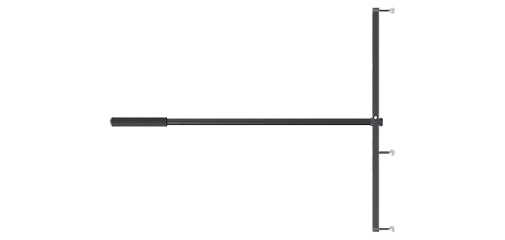
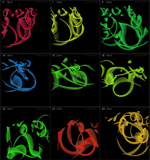

:::cover
:::

\tableofcontents
\newpage

# 緒言
## 背景

近年，モーションキャプチャ技術は，映像制作，スポーツ科学，医療・リハビリテーション，ロボティクス，ヒューマンインターフェースなど，多様な分野において広く利用されている．人体の動作を三次元空間上で計測し，骨格モデルや三次元モデルへ反映することにより，アニメーション生成や動作の定量的な評価，訓練・治療支援の高度化が可能となる．

一方，近年の動作解析では，人体の運動だけでなく，道具操作や手作業を伴う動作の理解が重要視されている．例えば，作業支援ロボットの研究，リハビリテーション動作の評価においては，人体の動きに加え，手に持つ工具や操作対象といった小型物体の運動を同時に計測することが求められる．このような小型物体を含めた動作計測は，動作全体の因果関係や操作意図を理解する上で重要な要素である[@vanani2025mesquite] [@twist]．

モーションキャプチャには複数の方式が存在するが，代表的なものとして光学式モーションキャプチャが挙げられる．光学式モーションキャプチャは，複数台のカメラによりマーカーを撮影し，その三次元位置を算出することで，高精度な絶対位置および姿勢情報を取得できるという利点を有する[@OptiTrackBase] [@spiceMocapAll]．しかし，小型物体を対象とした場合，十分な数のマーカーを配置することが困難であることや，手や身体による遮蔽の影響を受けやすいことから，安定した計測が困難となる．その結果，小型物体の姿勢情報が欠損しやすく，連続的な動作解析が妨げられるという課題が存在する[@spiceMocapAll]．

これに対し，慣性式モーションキャプチャは加速度センサおよびジャイロセンサを内蔵したIMUを対象に装着し，センサの情報から姿勢変化を推定する方式である．慣性式は遮蔽物の影響を受けにくく，センサを装着可能であれば連続的に姿勢変化を取得できるため，小型物体の計測に適している．一方で，角速度の時間積分による姿勢推定では誤差が蓄積しやすく，長時間計測において姿勢の信頼性が低下するという問題がある[@intertialMoCapMerit]．

光学式モーションキャプチャと慣性式モーションキャプチャを併用する研究事例[@OpticalAndInertialMoCap] [@MultiSensorHumanGaitDataset]は存在するものの，多くは人体動作の補完を主目的としたものであり，小型物体の動作計測を主目的として統合的に設計されたシステムは十分に検討されていない．

## 目的

光学式モーションキャプチャによって得られる高精度な絶対位置・姿勢情報を基準とし，慣性式モーションキャプチャによって得られる相対的な回転情報を組み合わせることで，両方式の欠点を相互に補完する統合的な計測環境を構築できれば，従来手法よりも高精度かつ安定したモーションキャプチャの実現が期待される．

本研究では，この考え方に基づき，光学式モーションキャプチャを基準とし，慣性式モーションキャプチャの手法を組み合わせた小型補助デバイスの開発を目的とする．

## 研究方針
本研究では，光学式モーションキャプチャシステムであるOptiTrackと連携可能な小型補助デバイスをSeeed Studio XIAO nRF52840を用いて開発する．本デバイスは小型物体への装着を想定した小型・軽量構成とし，搭載したIMUから小型物体の姿勢変化を推定する．

取得された小型物体の相対的な姿勢情報を，光学式モーションキャプチャによって得られる人体の絶対位置・姿勢情報と統合することで，小型物体を含めた動作を同一座標系上で扱う計測システムを構築する．これにより，遮蔽やマーカー制約によって光学式のみでは取得が困難であった小型物体の動作情報を補完する．

## 論文の構成
本論文の構成を以下に記す．

# 概要
本研究で開発するシステムは，光学式モーションキャプチャシステムOptiTrackと，IMUを搭載した小型補助デバイスを統合した構成である．光学式モーションキャプチャから取得される絶対位置・姿勢情報を親データ，補助デバイスから取得される相対的な姿勢変化を子データとして扱い，両者を同一の時間軸上で結合することで，小型物体を含めた動作計測を実現する．

補助デバイスには，3軸加速度センサおよび3軸ジャイロセンサを内蔵したSeeed Studio XIAO nRF52840を採用した．本デバイスは小型・軽量であり，小型物体への装着に適している．センサから取得した角速度および加速度データに対し，相補フィルタを用いた姿勢推定処理を施すことで，ジャイロセンサのドリフト誤差を抑制しつつ，動的な姿勢変化を追従可能とした．

OptiTrackと補助デバイス間のデータ同期には，OptiTrackのeSync2から出力される同期パルスを利用した．受信側デバイスがパルスを検知するたびにシーケンス番号をカウントアップし，このシーケンス番号を補助デバイスとの通信に付加することで，光学式と慣性式の両データを同一フレーム上で対応付ける．補助デバイスとの通信にはBluetooth Low Energy（BLE）を使用し，取得したデータはシリアル通信を介してPCへ転送される．

PC上では，OptiTrackから取得したモーションデータと補助デバイスから取得した姿勢データをシーケンス番号に基づいて統合し，Unityを用いて三次元空間上に可視化する．これにより，光学式モーションキャプチャでは取得困難であった小型物体の姿勢情報を，人体の動作と同一座標系上で表示することが可能となる．

# 光学式モーションキャプチャについて
## カメラとマーカー
光学式モーションキャプチャは，複数台の専用カメラを用いて対象の動きをキャプチャする．光学式モーションキャプチャのカメラは，赤外線を発光するストロボライトが内蔵されている．対象に取り付けるマーカーは，受けた光を直線で反射させる塗料を塗られた反射マーカーが使用される．これは，光は通常乱反射するため光源に到達する光量は小さくなるため，入射する光源の方向にのみ光を返すことで，強い光量を保つためである[@OptiTrackMarker]．

カメラから赤外線を発光し，反射した光をカメラで撮影することで，カメラから平面として見えるマーカーの位置が二次元座標で取得される．キャリブレーションにより，複数台のカメラの互いの位置と角度が定義され，キャリブレーション情報と各カメラの各マーカーに対する二次元座標をもとに，三次元座標を計算する．そのため，各マーカーは複数台のカメラのうち少なくとも2台以上のカメラから見えていることが必要となる[@OptiTrackBase]．

## キャリブレーション
光学式モーションキャプチャは三角測量の原理を用いて位置推定を行う．ある時刻において，カメラAおよびカメラBの両方に同一のマーカーが観測されたとする．このとき，各カメラからマーカーに向かってレイAおよびレイBが空間中に投射される．理想的にはこれら2本のレイは一点で交差するが，実際には観測誤差の影響により完全には交差しない．そのため，レイAとレイBの距離が最も近くなる点をマーカーの3次元位置として推定する．しかし，この手法を適用するためには，各カメラの位置および姿勢が既知である必要がある．そこで，事前にキャリブレーションを行う[@OptiTrackQuickGuide]．

キャリブレーションとは，複数台のカメラ間の相対的な位置および姿勢，焦点距離などの内部パラメータ，ならびに空間座標系における原点および座標軸の定義を行う処理を指す．本研究で使用する OptiTrack Prime 17w は，ダイナミックキャリブレーションと呼ばれる手法によってキャリブレーションが行われる[@OptiTrackQuickGuide]．

動作範囲内でマーカーを捉えることのできる位置にカメラを複数台設置し，キャリブレーションワンドと呼ばれる3つのマーカーが一列に配置されている機器([@fig:cal_wand])を用いてキャリブレーションを行う．キャリブレーションワンドに設置されたマーカーには中央のマーカーと，それぞれ距離の異なるマーカーが左右に1つずつ設置されている．機器を動作範囲内の空間中で動かすことで，各カメラのマーカーに関する2D座標が記録されていく．この時取得されたデータをもとに，各カメラのマーカーに対するレイが求められる．キャリブレーションワンド上にあるマーカー間の既知の距離関係を使用し，複数時刻にわたるデータ全体に対して再投影誤差が最小となるように最適化を行うことで，3D空間上におけるカメラ同士の相対的な位置および姿勢が推定される．この手法のことをバンドル調整(Bundle Adjustment)という[@triggs1999bundle] [@OptiTrackDocV3.0] ([@fig:cal_window]) ．

::: {.figures height=6cm}
{#fig:cal_wand width=45%}

{#fig:cal_window width=45%}
:::

以上の処理により，カメラ同士の相対的な位置および姿勢は推定されるが，この段階ではまだ計測空間における絶対的な座標系は定義されていない．そこで，次にグランドプレーンの設定を行う．

## グランドプレーンの設定
グランドプレーンとは，計測空間における基準平面を定義する処理であり，通常，床面に対応する平面が設定される．グランドプレーンを設定することで，ワールド座標系の原点位置および各軸の向きが決定され，計測された三次元位置データを物理空間と対応づけることが可能となる．

